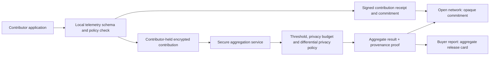

# AI Usage Intelligence Exchange

> Historical archive — 27 September 2026. Retained for its original scope, not current launch guidance. See the [active documentation](C:/AIChain/docs/README.md).

> Current baseline — 27 September 2026: [Platform current state](C:/AIChain/docs/platform-architecture.md) supersedes dated implementation and launch-status statements below. The governance workspace uses the private VPS API, sponsored Base Sepolia batches and live evidence verification. The 24-hour reliability run is in progress. Production identity, operations, automatic alerting and commercial release remain gated. Historical measurements and protocol semantics retain their original scope.

19 September 2026 · Proposed future product line · Not part of testnet or first commercial MVP

## Decision

There is a credible longer-term opportunity here, but call it an **opt-in AI Usage Intelligence Exchange**, not a marketplace for customer data.

The useful product is a buyer purchasing a narrowly defined, privacy-protected answer such as “what share of participating workflow runs in this sector used a model family for document classification this quarter?” It is not a buyer downloading prompts, outputs, traces, customer documents or a list of identifiable companies.

It can become a differentiated layer above the verification network because records can show when a contributor committed a declared telemetry record and whether a published aggregate was computed under a specified policy. It should not change the priority of reaching a usable testnet and public developer journey. Start discovery and a paper design now; defer implementation until there is an active contributor base and a proven product need.

## Why it could be valuable

AI teams, investors, researchers, insurers and enterprise buyers lack reliable independent signals about deployed AI usage. Current reports are often survey-based, provider-specific or hard to compare. An opt-in contribution network could generate useful benchmarks for:

- model-family adoption by declared task class;
- volume and seasonality of selected workflow types;
- tool and framework adoption;
- latency, reliability or policy-check rates, when definitions are standardised;
- changes in model/provider mix over time; and
- anonymised peer benchmarks for participating organisations.

Contributors gain benchmark access, potential revenue share or credits, and an auditable record of the scope to which they consented. Buyers gain a transparent methodology, coverage definition and reproducible aggregate proof—not a black-box claim that “the market” behaves in a particular way.

This is commercially viable only if the resulting statistics are sufficiently useful and differentiated that buyers pay more than the privacy, governance, support and data-quality costs. The verification network makes provenance and disclosure policy more credible; it does not create the underlying data supply or demand.

## Product boundary

| Layer | Allowed initial scope | Explicitly excluded |
|---|---|---|
| Private evidence | Remains with the contributor under the normal verification product | Automatic reuse, training-data sale, prompts, outputs, customer documents, credentials |
| Contribution telemetry | Opt-in, schema-validated coarse metadata and counts | Free-form text, direct identifiers, stable pseudonyms exposed to buyers, precise event time/location |
| Aggregate product | Predefined thresholded statistics or approved fixed query templates | Row-level export, arbitrary buyer queries, small cohorts, unrestricted joining with external datasets |
| Verification record | Commitment to contribution/policy/version and aggregate release receipt | Publication of raw telemetry or consent terms that identify participants |

“Model used” is sensitive commercial telemetry. “What it was used for” can reveal a person, customer, business strategy or regulated decision when combined with timing, geography or a rare task. Treat it as potentially personal/confidential until a documented risk assessment establishes otherwise. Hashing it, removing a company name or replacing it with a wallet address does not automatically anonymise it.

The UK ICO distinguishes anonymous information from pseudonymous personal data and warns that linkability can keep pseudonymous data within data-protection scope. Its guidance also calls for a case-specific assessment of anonymisation and data sharing. [ICO anonymisation guidance](https://ico.org.uk/for-organisations/uk-gdpr-guidance-and-resources/data-sharing/anonymisation/introduction-to-anonymisation/), [effective anonymisation](https://ico.org.uk/for-organisations/uk-gdpr-guidance-and-resources/data-sharing/anonymisation/how-do-we-ensure-anonymisation-is-effective/), [data-sharing code](https://ico.org.uk/for-organisations/uk-gdpr-guidance-and-resources/data-sharing/). This is a product-design constraint, not legal advice or a jurisdictional conclusion.

## Recommended model: a data cooperative with governed queries

The exchange should operate as a contributor-controlled pool. Each contributing organisation chooses a specific dataset class, permitted query catalogue, retention period and compensation/benefit policy. It can stop future contributions, but the system must state what happens to already published aggregates and irrevocably anchored commitments.

The platform publishes an **aggregate release card** with: metric definition, schema and taxonomy version, contribution eligibility policy, cohort/coverage statement, minimum cohort threshold, time window, privacy mechanism and parameters, query-budget identifier, computation version, publication time and verification status. It must disclose that results describe participating contributors, not all AI use.

Initial buyer access should be subscription to a small set of scheduled reports or fixed dashboards. Avoid real-time, custom, or per-company queries. A query catalogue lets the team assess privacy risk before a new statistic exists and prevents differencing attacks across many near-identical queries.

## Privacy architecture

The first privacy design should use all of these controls together:

1. **Data minimisation and a fixed taxonomy.** Send bucketed counts such as model family, broad task category and week—not raw strings. Unknown/rare values fall into a safe bucket or are rejected.
2. **Minimum cohort threshold and contribution cap.** Do not release a statistic unless enough independent eligible contributors meet a threshold, for example initially at least 100 organisations. Limit each organisation's influence through clipping so one large contributor cannot dominate a result.
3. **Secure aggregation.** The aggregation service should not see one contributor’s plaintext. Use a reviewed multi-party or secure-aggregation design with separate operators; do not call a central database “zero knowledge.”
4. **Differential privacy and a query budget.** Add calibrated noise and cap repeat/overlapping queries. Release the mechanism/version and privacy budget at a suitable abstraction; do not claim that aggregation alone prevents re-identification.
5. **Coarse release timing.** Scheduled windows and delayed publication reduce linkage to a known event. Avoid immediate event-level feeds.
6. **Governance and access controls.** A privacy review approves schemas, thresholds, release catalogue and changes. Audit buyers, prohibit attempted re-identification, and revoke access for breach.

Secure aggregation and zero-knowledge techniques have research support for privacy-preserving aggregate statistics, but they have meaningful implementation, operational and usability costs. [Prio](https://arxiv.org/abs/1703.06255) and [VPAS](https://arxiv.org/abs/2403.15208) are useful technical references, not implementation selections.

## Where ZK helps, and where it does not

| ZK-supported statement | Useful effect | It does not prove |
|---|---|---|
| A contribution satisfies the public schema, range and one-per-period policy | Blocks malformed/out-of-range contributions without exposing its values | The contributor's telemetry is truthful or complete |
| A contributor was eligible under a signed consent/policy at submission | Links participation to a declared, versioned permission | The contributor understood every downstream inference or that legal permission is sufficient |
| A published aggregate was computed from commitments in a stated eligible set using declared code | Lets buyers check computation provenance without receiving all inputs | The underlying set is representative, unbiased or free of fabricated inputs |
| A release passed cohort threshold and contribution cap | Makes these policy checks externally inspectable | That a threshold alone eliminates re-identification risk |
| A payment/reward rule was applied to qualifying contributions | Supports an auditable allocation calculation | Fair data valuation, rights to resell, or lawful processing |

Use ZK as a **verifiable policy and computation layer**. It complements differential privacy and secure aggregation; it does not replace them. Do not put raw contribution commitments, per-contributor timestamps or query answers on the public chain if that metadata allows linkage.

## Contribution and release lifecycle

1. The contributor receives a readable policy: fields, purpose, buyer classes, query catalogue, retention, compensation, withdrawal and incident process.
2. Its local agent maps events into the approved coarse schema, applies clipping and signs a contribution statement.
3. The application retains the encrypted contribution locally or sends secret shares to the approved aggregation operators. The network receives only an opaque commitment and policy identifier.
4. At the end of a scheduled window, the aggregation operators validate eligibility, enforce the cohort threshold and query budget, compute the approved statistic and apply the privacy mechanism.
5. The system publishes a release card, aggregate result and proof/attestation of the declared computation. It anchors the release commitment, not source rows.
6. Buyers purchase access to that release or a subscription. Contributors receive the agreed benefit from a transparent formula after policy checks.
7. A contributor can stop new contributions. The policy explains that already published aggregates cannot be retroactively removed from buyer reports; un-published contributions have a documented withdrawal and deletion route.

## Business model and incentives

Start with contributor benefit as benchmark access and reduced verification fees, rather than cash payments for every telemetry row. This avoids encouraging artificial volume or data fabrication before the quality model is mature.

Later, paid report revenue could be allocated between the platform, privacy/aggregation operations and a contributor pool. Any contributor reward should weight verified eligibility, diversity and marginal contribution under a transparent capped formula. Do not pay directly for raw event count; that rewards spam and creates misleading model-use statistics.

First buyers are more likely to pay for a useful sector benchmark, model-risk signal or vetted report than a generic “data marketplace.” Validate willingness to pay through five buyer interviews before building a contributor reward system. Do not merge this revenue with verification API revenue in reporting; it has different compliance, quality and margin characteristics.

## Staged roadmap

| Stage | Work | Entry / exit condition |
|---|---|---|
| I0: discovery, now | Ten contributor interviews and five prospective buyer interviews; taxonomy, risk register and candidate reports | No collection or resale; establish a repeated buyer question and contributor consent appetite |
| I1: private benchmark experiment, after public developer/testnet path works | Synthetic data and fixed aggregate reports; usability/privacy red team; no money or customer data | Independent privacy/security review approves the design; test data cannot be mistaken for market signal |
| I2: opt-in pilot, after verified active contributor base | Small approved cohort, fixed monthly report, contributor-held/secret-shared data, no raw export | Minimum cohort and diversity targets, lawful basis/contract/process agreed with appropriate advice, successful withdrawal/incident drill |
| I3: paid intelligence product | Subscription reports, audited aggregate releases and defined contributor benefit | Buyer renewal and privacy/quality/cost metrics justify operating it |
| I4: governed exchange | Wider catalogue only after sustained governance, query-budget and anti-reidentification evidence | Independent review and explicit go/no-go decision per expansion |

I0 may run in parallel with the testnet programme because it is discovery, not platform construction. I1–I4 must not delay the testnet, SDK or live website. This remains a separate product track that earns investment only after the core verification product has active users.

## Required decisions before collection

1. Which legal entity controls the contribution data, which processors operate aggregation, and which jurisdictions apply.
2. Exact schema, taxonomy owner, permitted buyer classes and whether any field can relate to a person or sensitive decision.
3. Contribution eligibility and Sybil-resistance policy; a receipt alone does not establish an independent organisation.
4. Minimum cohort/diversity thresholds, clipping, time-window and privacy mechanism parameters, based on specialist review rather than fixed in this plan.
5. Consent/contract wording, withdrawal treatment, retention/deletion, contributor benefits and buyer terms prohibiting re-identification.
6. Independent security/privacy review, aggregation operator model, incident handling and audited implementation plan.
7. Data-quality methodology: sampling bias, incentives, provenance confidence, missingness and report limitations.

## Go/no-go criteria

Proceed from discovery only if at least three contributors are willing to provide the proposed coarse telemetry under a transparent policy, at least two buyers would pay for a defined benchmark, and independent review finds a credible route to prevent raw/identifiable disclosure. Stop if the only compelling data is prompts/outputs, if the cohort is too small/diverse for safe aggregation, or if contributors cannot understand/control downstream use.

The exchange can strengthen the network story later: the chain provides a neutral receipt and release chronology; ZK can make aggregate policy/computation claims inspectable. The core product must first earn trust by proving it does not opportunistically monetise customers’ private evidence.
