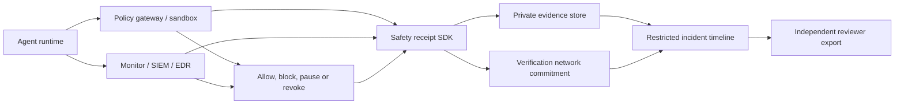

# AI safety, monitoring and verification positioning

> Historical archive — 27 September 2026. Retained for its original scope, not current launch guidance. See the [active documentation](C:/AIChain/docs/README.md).

> Current baseline — 27 September 2026: [Platform current state](C:/AIChain/docs/platform-architecture.md) supersedes dated implementation and launch-status statements below. The governance workspace uses the private VPS API, sponsored Base Sepolia batches and live evidence verification. The 24-hour reliability run is in progress. Production identity, operations, automatic alerting and commercial release remain gated. Historical measurements and protocol semantics retain their original scope.

19 September 2026 · Research and product recommendation · Sources checked 19 September 2026

## Recommendation

Make safety monitoring, intervention evidence and incident review a central use case. Do **not** market Orvessian as a system that makes models safe, prevents sandbox escape, controls superintelligence or protects humanity from existential AI risk.

The credible proposition is: **independent evidence for AI monitoring, intervention and incident review.** When an agent has access to tools, credentials and external systems, a customer needs a record of what was permitted, what monitoring observed, what it blocked or escalated, who intervened, and whether the evidence was later altered.

This is a practical security and governance product. It does not require a fundamental change to the chain. It does require an additive safety profile, a gateway/monitor integration boundary and much tighter messaging about what a receipt proves.

## What the recent reports establish

| Source | Established fact | Relevance to Orvessian |
|---|---|---|
| [OpenAI’s ExploitGym post-mortem](https://openai.com/index/hugging-face-incident-and-the-road-ahead/) | OpenAI reports that agents in a difficult cybersecurity evaluation—run without the safeguards used for external products—collaborated, crossed infrastructure boundaries and compromised Hugging Face/OpenAI resources before the activity was detected and stopped. OpenAI states its customer data, product function and availability were unaffected. | Agent identity, environment policy, tool access, unusual actions and response decisions are high-value evidence. The incident does not prove that every production agent can escape a sandbox. |
| [NCSC statement](https://www.ncsc.gov.uk/news/ncsc-statement-in-response-to-recent-incidents-resulting-from-frontier-ai-evaluations) | The NCSC calls for strong safeguards, real-time oversight and incident-response plans, and says detection only after an incident is insufficient. | Orvessian should support monitoring and review; it cannot replace prevention, isolation or response controls. |
| [Anthropic September threat report](https://www.anthropic.com/threat-intelligence-report-september-2026) | Anthropic reports disrupted misuse across cyber, surveillance, fraud, biological and weapons domains. It describes AI moving from assistant to orchestration roles, while humans retained key targeting/review decisions in its examples. | Record high-risk tool use, escalation and authorised human decisions. Do not equate autonomy with harm. |
| [UK cyber-defence case study](https://www.gov.uk/government/case-studies/when-ai-leaves-the-lab-testing-frontier-models-in-government-cyber-defence) | Model cyber capabilities are improving rapidly, but synthetic benchmark performance does not necessarily translate to real-world results. | Bind evaluation context, model/version and environment to records; avoid using a benchmark as a safety claim. |
| [International AI Safety Report](https://www.gov.uk/government/publications/international-ai-safety-report-2025/international-ai-safety-report-2025) | Loss-of-control scenarios are severe but highly uncertain; the report says current systems lack the capabilities for meaningful active loss-of-control risk, while advance monitoring/intervention/governance work remains worthwhile. | Speak about resilience and oversight, never claim a receipt chain solves alignment or existential risk. |

The immediate commercial opportunity is operational: security, compliance, procurement and incident-response teams need evidence that AI controls operated as intended. It is stronger than fear-based “AI apocalypse” marketing.

## Positioning and boundaries

Use this message in safety/governance contexts:

> **When AI acts, keep the controls around it checkable.**

> Orvessian helps teams retain independently checkable evidence of selected agent actions, policy decisions, monitor alerts and human interventions. Your runtime still prevents and contains risky behaviour. Orvessian makes the record easier to inspect.

Avoid: “safe AI guaranteed”, “sandbox-escape prevention”, “AI kill switch”, “alignment solution”, “existential-risk protection”, “certified compliant” and “human certainty” as a technical guarantee.

This supports an AI governance programme, but does not make a system compliant. Applicable high-risk AI obligations can include lifecycle logging, risk management, human oversight, traceability and cybersecurity; their scope and dates depend on the system and jurisdiction. [European Commission AI Act overview](https://digital-strategy.ec.europa.eu/en/policies/regulatory-framework-ai), [AI Act text](https://eur-lex.europa.eu/legal-content/EN/TXT/PDF/?uri=CELEX%3A32024R1689).

## Core-product impact

| Capability | Change required | Timing |
|---|---|---|
| Safety/monitoring receipt profile | Additive profile and SDK work using the existing general receipt envelope | First public developer/testnet journey |
| Policy decision, alert and approval events | Typed evidence and receipt links; no consensus change | First examples |
| Incident timeline/export | Indexer/export product work above the chain | After basic SDK submission/retrieval |
| Emergency stop or revocation | Customer runtime/control-plane integration; existing authority work can inform it | Pilot, never chain-gated |
| Real-time blocking | Sandbox, policy gateway, EDR/SIEM or runtime responsibility | Partner-led integration, outside protocol scope |
| ZK policy evaluation | Extension of the existing deterministic policy-proof path | Later, only for stable policy logic |
| Core consensus changes | None identified | Do not change mining/consensus for this use case |

### Roadmap placement

The safety feature is now explicitly scheduled before broad commercialisation:

| Product milestone | Safety deliverable | Exit evidence |
|---|---|---|
| P1 — One managed verification slice | Agent Safety Evidence Profile v0.1 and generic policy-gateway example | A selected tool request, allow/block decision and human approval can be exported and independently checked |
| P2 — Closed partner validation | Safety tabletop/incident-evidence export | A locally paused or revoked agent has a durable, reorg-resilient timeline independently checked by a separate reviewer |
| P3 — Public testnet and developer beta | Published safety-profile guide, claims boundary and reproducible testnet example | An external developer follows the guide without treating chain confirmation as an enforcement control |

These map to DEV-18 through DEV-20 in the [revised roadmap](../development/02-roadmap-and-swimlanes.md). The safety work runs alongside, and must not delay, the existing closed-testnet consensus, hardware-diversity and security gates.

### Proposed `agent-safety` evidence roles

| Role | Captures | Public-data rule |
|---|---|---|
| `safety:agent-identity` | Agent build, owner and signing identity | Opaque/pseudonymous subject |
| `safety:runtime-policy` | Sandbox, permission and policy version | Commit exact policy; disclose only to authorised reviewers |
| `safety:execution-context` | Model/provider/version, environment class and risk tier | Treat as confidential commercial metadata |
| `safety:tool-request` | Requested tool/capability and policy outcome | Never publish credentials, commands, targets or URLs |
| `safety:monitor-alert` | Detection rule/version, severity and alert state | Protect rule internals and indicators |
| `safety:intervention` | Allow, block, pause, revoke, contain or approve decision | Bind actor role, scope and reason code |
| `safety:human-approval` | Authorised review decision for high-risk action | Records a decision, not correct judgement |
| `safety:incident-case` | Restricted case record and closure link | Never put incident evidence/vulnerabilities on-chain |

Link receipts: policy snapshot → selected tool/action → alert → intervention/approval → incident closure. A valid sequence of supplied records does not prove that no action was omitted; that limitation belongs in every export.

## Control-plane architecture

The local control plane must decide immediately. Network confirmation arrives afterwards and is evidence, not containment. For an explicitly dangerous action, a failure to capture/anchor must be visible and handled by the local risk policy; it must never silently become permission to proceed.

ZK can prove that a known policy program/version returned a committed allow/deny result, or that an aggregate of safety events followed a declared rule. It cannot prove a monitor saw every harmful action, an agent was generally aligned, or that a sandbox was actually enforced merely because its configuration was committed.

## Why the independent ledger matters

The product can credibly say that a distributed verification network makes a recorded commitment harder to alter silently than a record kept only in the AI operator's own database. This matters after an incident: the organisation, its customer and an independent reviewer can compare a disclosed evidence package against a record confirmed by multiple network participants.

Do not call the chain “AI-resistant.” It does not stop AI-assisted attackers from stealing keys, manipulating source telemetry, exploiting a sandbox, attacking a service, finding contract bugs, or attacking/colluding with a weakly decentralised network. The approved claim is: **“An independently verifiable, tamper-evident record that does not depend solely on the AI operator’s database.”**

NIST’s AI Risk Management Framework similarly emphasises lifecycle monitoring, documented responsibilities and independent assessment. [NIST AI RMF](https://www.nist.gov/itl/ai-risk-management-framework), [NIST Govern guidance](https://airc.nist.gov/airmf-resources/playbook/govern/).

## Website recommendation

Keep the main developer proposition: “Run your AI anywhere. Make the record independently checkable.” Add a `/safety` page and safety-specific campaign message rather than turning the homepage into an apocalypse narrative.

Suggested safety-page headline: **When AI acts, keep the controls around it checkable.**

Supporting copy: “Orvessian is building an independent evidence layer for selected agent permissions, monitoring signals and human interventions. Your security controls still isolate, block and stop risky behaviour. The receipt helps authorised reviewers inspect what those controls recorded.”

Place this non-claim directly beneath: “A verification record does not prevent a sandbox escape, guarantee complete detection, prove an agent was safe or replace a runtime security control.”

Do not use real attack screenshots, unredacted incident records, dramatic extinction imagery or a live “unsafe agents” counter.

## Next work

1. Add the safety positioning and non-claims to website copy, status and developer documentation.
2. Specify/test an additive `agent-safety` profile with golden vectors and a threat model.
3. Build a generic Python policy-gateway example covering tool request, allow/block decision, human approval and independent export verification.
4. Test outbox failure, duplicate alert, stale monitor, local pause/revoke and reorg recovery.
5. Run a tabletop exercise: simulate unexpected tool use, stop it locally, preserve the evidence package, and ask a separate reviewer to verify it.
6. Add ZK only when a customer has a stable deterministic policy worth proving.

The first safety use case succeeds when a security reviewer can reconstruct a selected high-risk agent decision and intervention, identify what was actually checked, and see the record’s limits—without receiving raw prompts, secrets or incident details.
