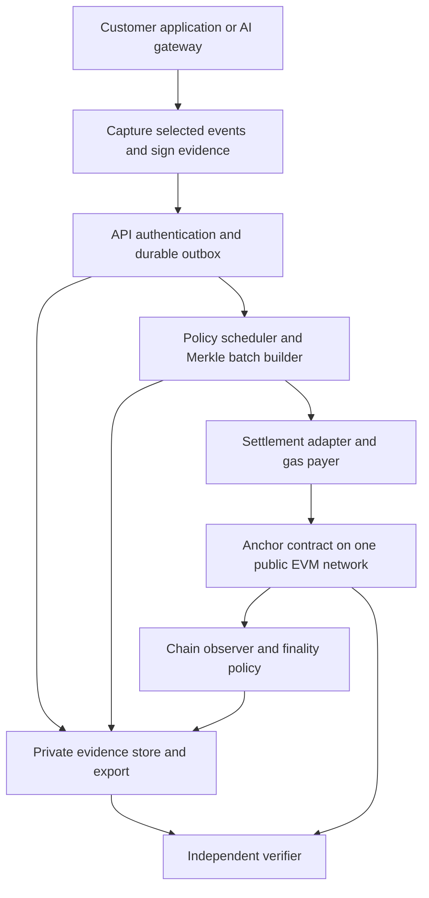

# Settlement architecture: own PoW, own alternative consensus, or an existing network

> Historical archive — 27 September 2026. Retained for its original scope, not current launch guidance. See the [active documentation](C:/AIChain/docs/README.md).

> Current baseline — 27 September 2026: [Platform current state](C:/AIChain/docs/platform-architecture.md) supersedes dated implementation and launch-status statements below. The governance workspace uses the private VPS API, sponsored Base Sepolia batches and live evidence verification. The 24-hour reliability run is in progress. Production identity, operations, automatic alerting and commercial release remain gated. Historical measurements and protocol semantics retain their original scope.

**Decision adopted after this analysis:** on 20 September the founder selected Base for launch and evaluation of larger/hierarchical batching. [ADR-0009](C:/AIChain/docs/decisions/0009-base-launch-settlement.md) and [the transition audit and revised roadmap](C:/AIChain/docs/archive/2026-09-27/superseded-plans/base-transition-audit-and-roadmap.md) record the accepted direction. The comparative recommendation and pending-selection language below are retained as the analysis that led to that decision, not a still-open choice between Base and Arbitrum.

20 September 2026 · Decision analysis and proposed implementation direction · Not an accepted consensus change or deployment authorisation

## 1. Decision and reasons

**Build Orvessian as a verification and evidence product on an established public EVM network. Treat that as the intended production architecture, with no planned migration to an own L1.** Select one settlement network before the public SDK and receipt format freeze. Use Base and Arbitrum One as the focused implementation shortlist; Base is a provisional integration candidate, not a proven winner on cost or operational risk.

The scarce resource is development and operational capacity. The differentiating work is trustworthy capture, signed receipts, explicit verification semantics, privacy, evidence retention, independent verification, AI integrations and reliable delivery. A proprietary consensus network does not make those capabilities correct. It introduces another security system that must be funded, maintained and defended before customers can rely on the product.

This changes the recommendation in [the earlier consensus review](12-consensus-and-miner-value-review.md): do not keep new miner features running as a parallel product priority by default. Preserve the existing node/miner work and its engineering history, but remove new mining development from the proposed launch critical path. No running services or source implementations are changed by this paper.

Option 1 remains defensible if sovereign settlement becomes a demonstrated customer requirement and an independently funded security programme exists. Option 2 is appropriate only for a specific validator or consortium requirement; replacing PoW with PoS does not outsource consensus security. Option 3 best meets the present goal: build the backend once, launch the verification offering, and maintain it without an obligatory chain replacement.

This is a decision about architecture, not a promise of zero future maintenance. Every option needs upgrades. The objective is to avoid a known future rebuild and to isolate changes to settlement integration rather than spread network assumptions across the product.

## 2. What the product must prove

The core promise is: **selected AI activity can be recorded as signed evidence, committed to a public ledger, and checked independently of Orvessian's hosted service.** A record of “why” means the supplied policy, approval, reason code or explanation; it does not establish access to an AI model's true internal reasoning.

| Required outcome | Mechanism | What the chain contributes |
|---|---|---|
| Detect changes to disclosed evidence | Exact-byte commitments, random salts, canonical receipt encoding | A later comparison point outside the service's database |
| Identify the signer | Signature verification plus independently meaningful issuer identity and key history | Public inclusion of the commitment; a gas-paying relayer is not the evidence author |
| Show inclusion and publication timing | Receipt, Merkle membership proof, transaction/block evidence and finality policy | Ordering and ledger inclusion under the selected network's assumptions |
| Detect recorded-stream gaps or forks | Signed sequence and predecessor relationships, declared capture boundary | A durable commitment to the submitted sequence |
| Explain an intervention | Captured policy version, request/action, decision, approval and outcome | Evidence integrity; no runtime containment |
| Prove a particular computation or property | A specified proof system, verified circuit/program, public inputs and verifier | Optional execution or anchoring of a proof; ordinary anchoring is not a ZK proof |
| Recover evidence years later | Retained receipts, manifests, openings and independent exports | The anchor alone cannot reconstruct deleted private evidence |

All options share an important limit: a compromised agent can submit a false record, bypass instrumentation, omit an event, or steal a signing key. Consensus cannot repair those problems. Stronger capture can involve a separately controlled gateway, key isolation, source attestations and monitoring. It must state exactly which boundary was observed. A hash committed at a block establishes a publication bound under that chain's time/finality rules, not the exact real-world event time.

Do not claim “AI-resistant blockchain” as a product property. Distributed, independently controlled consensus can make unilateral ledger rewriting harder. That is a narrower, useful claim; it is not a claim that AI cannot attack endpoints, exploit contracts or compromise operators.

## 3. Current implementation evidence

The active source reviewed is `C:\AIChain`, HEAD `d864c3a292020ace158e5629addbe57c644e2a02`, with existing local changes. The review does not treat that commit as a clean or released production build. The current [closed-testnet foundation](C:/AIChain/docs/archive/2026-09-27/own-chain/phase-4-closed-testnet-foundation.md) retains KawPoW as a development profile and leaves mainnet decisions open. Its latest hardware scope is NVIDIA/CUDA; AMD/OpenCL is deferred post-mainnet. Older strategy references to immediate AMD work lag that source.

| Component inspected | Reuse on an existing EVM network | Work still required |
|---|---|---|
| [Receipt and signing library](C:/AIChain/sdk/typescript/verification-receipt.js) | Canonicalisation, commitments, profiles, signatures, stream relationships | Settle destination binding before format freeze; test deployed integration |
| [Batch anchor contract](C:/AIChain/contracts/avr-anchor/src/ReceiptBatchAnchor.sol) | Small Solidity commitment registry; no custom consensus dependency identified | Public adversarial review, deployment reproducibility, bytecode pinning, root ownership semantics |
| [Individual anchor](C:/AIChain/contracts/avr-anchor/src/AVRAnchor.sol) | EVM implementation | Sender/issuer coupling makes silent relaying unsuitable for customer authorship |
| [Anchor verifier](C:/AIChain/sdk/typescript/avr-anchor-verifier.js) | Ordinary RPC receipt, event and canonical-block checks | Current block-depth policy is not an L2 settlement policy; implement explicit network-specific assurance |
| Ingress, presentations and general receipt tests | Queue semantics, deduplication, commitment presentations and test vectors | Production transactional persistence, multi-instance recovery, quotas, monitoring and custody controls |
| Node, KawPoW/ASERT and miner packaging | Useful retained research, test tooling and operator experience | Not a production dependency under option 3 |

The [capacity prototype](C:/AIChain/docs/capacity-and-batching-prototype.md) reports historical batch anchors around 92,831 gas for tested batches, including 10 and 100 leaves. This was an older local Ethash workload, not a current KawPoW or public-L2 benchmark. It supports the structural batching approach; it does not establish production fees, latency or throughput.

Fresh validation on 20 September: **27/27 tests passed** across `verification-receipt.test.js`, `avr-anchor-verifier.test.js`, `avr-ingress-queue.test.js` and `avr-presentation.test.js`. These cover signed identity/destination binding, stream integrity, batch inclusion, orphan rejection, queue bounds and recovery callbacks. They do not establish deployed-contract security, distributed durability or external-network finality.

### Two issues to resolve regardless of consensus

1. The current batch contract indexes roots globally, permits any sender, and records the sender as issuer. Someone observing a pending root could anchor it first, reserving that root under a different sender. This is an identified design risk, not a demonstrated exploit in this review. Review a sender-namespaced registry or an explicit authorisation/idempotency design; keep receipt author and batch submitter separate. Do not solve this by claiming every public submitter is trusted. Leaf count and schema metadata are supplied by the submitter; the contract does not verify every leaf or signature.
2. Receipt schema `0.4.0-alpha` commits the chain ID and EVM anchor contract address into the signed receipt identity. Stream continuity also compares recording context. Moving chains later changes identities/signatures and can break stream continuity. **It is not just an RPC configuration change.** Old signed receipts must remain valid on their original destination, never rewritten or retrospectively relabelled.

## 4. Comparison of the three options

| Dimension | 1: own PoW L1 | 2a: own permissionless PoS L1 | 2b: own permissioned BFT L1 | 3: established public EVM network |
|---|---|---|---|---|
| Security bootstrap | Recruit independent hash power and sustain rewards | Establish stake distribution, validator economics and honest participation | Recruit named independent operators and enforce governance | Use external consensus; retain contract, protocol, sequencer and governance dependencies |
| Who orders blocks | Miners/pools | Staked validator set | Approved validators | Existing network's block producers/sequencer |
| Native token required for this plan | Yes, for own gas and rewards | Normally yes, for staking/security and gas | Not necessarily a market-traded token | No Orvessian token required; operator pays the network's gas asset |
| Main launch burden beyond product | Node/miner/pool releases, difficulty, reorgs, economics | Consensus stack, genesis, staking, penalties, validator tooling, upgrades | Validator governance, keys, quorum, node operations and membership changes | Settlement adapter, gas funding, finality observation and external dependency operations |
| Existing EVM work | Strong reuse | Strong if choosing a mature EVM stack; not automatic | Strong if using an EVM BFT client | Strong on an EVM chain; deployment and behavioural tests still needed |
| Independence from our company | Conditional on real miner independence | Conditional on actual stake/operator independence | Limited by consortium membership/control | Ledger outside our control; hosted capture/retention still depends on us unless exported |
| Control of fees and upgrades | High, constrained by miner adoption | High, constrained by validator/governance adoption | High within consortium | Low at network level; control our application contract lifecycle |
| Fast finality | Probabilistic confirmations; hashrate/reorg dependent | Protocol-specific BFT finality subject to stake assumptions | Fast quorum finality subject to validator assumptions | Network-specific; L2 soft inclusion differs from Ethereum-backed data finality |
| Staffing fit now | Weak | Weak | Conditional, better than sovereign PoS but still substantial | Strongest |
| Overall recommendation | Preserve, defer new launch work | Do not adopt merely to remove miners | Only for an actual consortium buyer/operator requirement | Adopt as proposed production direction |

### Option 1: own L1 with PoW

The strongest reasons are open participation, control of block-space policy, community distribution and sovereign settlement. Keeping the current EVM execution stack also avoids an immediate execution-layer port.

The central problem is security bootstrap. A consensus algorithm's correctness is different from the economic difficulty of overpowering a small network. Difficulty adjustment regulates block timing; it does not manufacture honest hash power. A more expensive algorithm does not automatically make a network harder to dominate if attackers and honest miners face the same adjustment.

KawPoW is an existing algorithm family, not evidence of an exclusively AIChain-specific hardware barrier. A new chain ID or branded miner does not prevent compatible GPU operators or future specialist hardware from competing. Customising hashing requires independent cryptographic/performance review and does not justify a promise of permanent ASIC exclusion.

Miner incentives need an explicit model:

```text
miner revenue in fiat = native coin price × (coins issued to miners + miner fee share)
miner margin = revenue - power - equipment - hosting - pool fees - operations
```

Neither price nor willing demand is guaranteed. Miners selling coins to pay costs is normal. A 60% allocation says how issuance is divided, not whether aggregate rewards purchase enough security. A small number of public-chain anchors may be commercially valuable yet generate little chain fee revenue. Batching makes that divergence larger: success for customers need not produce proportionate miner income.

Work required includes hashrate-shock and timestamp/reorg simulations, adversarial difficulty review, independent miners/pools, protocol upgrade drills, release support, state growth, bootstrap peers, explorers, keys and incident response. These are additions to the verification backlog. The earlier mining work package is a plan; this review found no basis to represent its proposed economic/security simulations as completed evidence.

Choose this only if customers value our sovereign consensus enough to fund it, and a separate capable protocol/security function can sustain it. The wish to engage miners is valuable community strategy but insufficient as the deciding architectural requirement.

### Option 2: own L1 with a different consensus

**Permissionless PoS** removes mining hardware and energy competition but introduces stake distribution, validator admission economics, slashing or other penalties, delegation/concentration, key management, genesis trust and recovery governance. It secures the chain with our validator set and assets; using an established PoS implementation does not import Ethereum's economic security. Ethereum's own mechanism illustrates the role of stake and penalties, not security inherited by a fork. [Ethereum PoS documentation](https://ethereum.org/developers/docs/consensus-mechanisms/pos/)

An EVM-compatible mature implementation can preserve contracts while replacing the node/consensus stack. It is not a switch in the current KawPoW configuration. An implementation selection and compatibility review would still be needed. Choosing a custom PoS protocol is unjustified for this product at present.

**Permissioned BFT / proof of authority** means known organisations operate approved validators, potentially on a publicly readable chain. It need not mean private data or a tradeable coin. For example, Besu QBFT needs a sufficient supermajority of validators and stalls if more than a third are unavailable. Four validators tolerate one Byzantine fault under the protocol assumptions; seven tolerate two. Four servers administered by us still represent one controlling organisation. [Besu QBFT documentation](https://docs.besu-eth.org/private-networks/how-to/configure/consensus/qbft)

This is viable if credible independent institutions agree to operate validators, pay for operation, govern admission/removal and accept shared responsibility. The benefit is predictable consortium operation and membership, not automatic permissionless neutrality. We would own availability, software upgrades, validator key rotation and quorum recovery. External anchoring can make consortium history more independently checkable, but then we operate two systems; it is not the resource-minimal launch.

Neither variant has a demonstrated requirement in the current product brief. PoS is not inherently safer for AI evidence than a well-operated PoW or external chain; the actual distribution of control and failure assumptions matter.

### Option 3: deploy the application on an existing network

This means deploy our anchor contract as an application on a public blockchain and submit transactions to it. It does **not** mean create a private network and distribute our own validators. Our API, storage and indexing can be ordinary managed services. Public network participants run consensus independently of us.

We can operate our own full/verifying node or use RPC providers; these are access/verification choices, not a requirement to become a block producer. For an Ethereum L2, independent verification can additionally require Ethereum connectivity and the selected L2's derivation/proof machinery. Two RPC providers improve availability and detection of disagreement, but do not constitute cryptographic independent verification by themselves.

The benefits are the clearest fit for this project: reuse EVM contracts and tooling, avoid launching a security economy, reduce operational surface, and place commitments beyond unilateral company database control. The tradeoff is dependence on external rules, fees, capacity, upgrades and—in many L2s—sequencing infrastructure. The application remains ours; the network does not automatically own our data, customers or intellectual property.

## 5. External network shortlist and tradeoffs

**Use an established EVM network rather than select by advertised TPS.** Batch commitments are small; evidence ingestion and storage are likely to dominate before raw chain transaction throughput does. Base's own documentation cautions that capacity depends on gas and data usage rather than a single transaction-per-second number. [Base throughput and limits](https://docs.base.org/specifications/transactions/throughput-and-limits)

| Candidate | Fit | Main tradeoff | Decision position |
|---|---|---|---|
| Base | Existing EVM contracts; Ethereum L2; practical candidate for the first reusable integration | Sequencer, upgrade controls and current protocol configuration must be understood; fees and finality are staged | Provisional integration candidate, subject to the gates below |
| Arbitrum One | Existing EVM contracts; Ethereum rollup; strong alternative for identical workload comparison | Sequencer and governance dependencies; distinguish data finality from assertion settlement | Compare directly with Base before choosing one |
| Polygon PoS / Polygon Chain | EVM-compatible alternative with its own validators and rapid milestone finality | Ethereum checkpoints do not make its validator security identical to an Ethereum rollup | Reserve if independent PoS settlement assumptions are acceptable and measured needs favour it |
| Solana | High-capacity independent public L1; viable for a new application | Native program/account and client model differs from current EVM implementation | Do not port for headline throughput alone |
| Ethereum L1 directly | Straightforward independent EVM anchor without an L2 sequencer | Higher and variable per-anchor cost; larger/slower batches may be needed | Cost/security reference, potentially sufficient at low frequency; not the first latency/cost hypothesis |

Polygon's current architecture uses Heimdall-v2 for validator/stake management, Bor producer selection, milestones and periodic Ethereum checkpoints. The security distinction matters more than the speed label. [Polygon architecture](https://docs.polygon.technology/pos/architecture/heimdall_v2/introduction)

Native Solana programs separate code and account data, commonly using Rust/C++; its migration documentation also describes EVM-compatibility approaches. Such tooling does not establish drop-in compatibility for our contracts, signatures, RPC verifier and receipt destination format. A native port would require a separately reviewed implementation and new vectors. [Solana migration documentation](https://solana.com/developers/migrate-to-solana/smart-contracts)

Do not substitute Arbitrum Nova/AnyTrust or an arbitrary “EVM chain” for Arbitrum One without revisiting data availability and control assumptions. Do not create an own rollup/appchain as a supposed shortcut: sequencing, upgrades, data availability, bridges and operator responsibility still create a network programme.

### Finality is a product field, not a confirmation counter

Base documents stages from preconfirmation and L2 inclusion through L1 batch inclusion and L1 batch finality, with illustrative times from fractions of a second to roughly 20 minutes. Its seven-day withdrawal process is a separate consideration from ordinary transaction inclusion. These are documentation descriptions, not our measured service guarantees. [Base transaction finality](https://docs.base.org/specifications/transactions/transaction-finality)

Arbitrum distinguishes provisional sequencing, parent-chain data finality and later confirmed assertions. Its documented force-inclusion mechanism can bypass a refusing sequencer after a configurable delay, roughly 24 hours by default; it is not instant recovery. Rollup data publication differs from AnyTrust's committee-based availability. [Arbitrum finality](https://docs.arbitrum.io/how-arbitrum-works/deep-dives/finality)

For evidence, independently deriving the correct execution from finalized input data is different from trusting an RPC response, and different again from waiting for an output assertion usable by an L1 contract. The verifier must name which assurance it established. Ordinary customer acknowledgements must not imply all these stages completed. Use a published policy with observed block references, policy version and verification time; report unsupported checks as unknown, not passed.

### Governance and change risk

Base documents upgrade approvals involving Coinbase signers and an independent Security Council. Arbitrum likewise has governance and Security Council emergency powers. Neither should be marketed as an external protocol that nobody can change. Review deployed roles, upgrade paths, delays, proof systems and incident powers at production selection, not just website labels. [Base council](https://docs.base.org/specifications/security/security-council-for-base), [Arbitrum council](https://docs.arbitrum.foundation/concepts/security-council)

Base's current documentation lists its Azul independent upgrade as live on mainnet since 28 May 2026, including changes to node/proof components. That is a reason to pin actual deployed versions and not assume historical OP Stack descriptions remain sufficient. This review did not independently verify activation or deployed control state from chain data. [Base Azul overview](https://docs.base.org/upgrades/azul/overview)

## 6. What changes commercially and operationally on another network

| Question | Implication |
|---|---|
| Do customers need crypto? | No for the managed path. We pay gas and sell API/evidence services in ordinary commercial units. Independent self-submission requires gas funding or a sponsor. |
| Where does revenue go? | Orvessian earns integration, processing, retention, proof and enterprise-service revenue. The underlying network earns transaction fees. |
| Can we still have a token? | Technically yes, but an application token is not the network's native security/gas asset. There is no launch requirement for one. |
| Does the 60% mining allocation survive? | It is conditional on choosing an own issuance/mining design. It has no necessary role in the recommended launch. |
| Do we control transaction priority? | We control our queues and fee budgets; we cannot guarantee public-network inclusion or exclude unrelated traffic. |
| Are customer records public? | Put salted commitments and minimal metadata on-chain, not raw prompts, names, outputs, secrets or reasons. Sender, timing and batch metadata can still reveal patterns. |
| Is this a data marketplace? | The same receipts can support provenance of opted-in aggregates later. Neither anchoring nor ZK proves that source telemetry was complete, truthful or properly consented. |
| Can the network censor us? | It can delay inclusion through its ordering mechanisms; recovery depends on the chosen protocol. An RPC provider may block access independently of consensus. |
| Can we leave? | Future traffic can move through a deliberate versioned change; historical receipts retain their original network dependency. “Portable” does not mean erasing that dependency. |
| Do we need a bridge? | Not to move AI evidence between chains: keep private evidence off-chain. Funding gas may use supported on-ramps or bridges; treasury exposure should be bounded. |
| Is the product fully decentralised? | Settlement can be external/public while API operation and retained private data are centralised. Disclose each layer separately. |

Free/pro pricing still works: free accounts can receive lower quotas and longer batch windows; pro accounts can receive shorter submission targets, reserved service capacity, priority retries and stronger retention/support. Use fair scheduling and bounded maximum wait so free work is not silently starved. Urgent events can close a batch early or use a dedicated batch with an explicit higher cost. Do not sell guaranteed instant finality that the network cannot supply.

The prior proposed non-miner split (15% treasury, 10% ecosystem, 10% team, 5% strategic) is not a settled allocation. Keep it as a scenario if own-chain economics returns. Likewise, an indefinite tail emission and a fixed lifetime 60% mining reserve/hard cap cannot all be assumed simultaneously. An adaptive subsidy offset against fees can leave total miner revenue unchanged and introduces incentive questions; it has not been validated as a security solution.

## 7. Capacity, batching and cost model

The reusable [calculation script](../../../development/tools/model-settlement-options.mjs) produces [the scenario data](../../../development/review/settlement-options-model.json). This is planning arithmetic with steady fluid arrivals, not a throughput measurement, queue simulation, live fee quote or hashrate-shock simulation.

Assumptions: one shared queue unless stated, at most 1,000 events per batch, close after 10 seconds from the first event if not full, no empty batches. Approximate batch size is `min(1000, 1 + events_per_second_per_queue × 10)`. Approximate anchors/day is events/day divided by that batch size. Bursts, retries, integer/finite-window effects and tenant arrival variation require later measurement.

| Logical workload | Approx. events/batch | Approx. anchor transactions/day | Approx. anchor TPS |
|---|---:|---:|---:|
| 50,000 events/week | 1.83 | 3,910 | 0.045 |
| 1 million/day | 116.74 | 8,566 | 0.099 |
| 10 million/day | 1,000 | 10,000 | 0.116 |
| 100 million/day | 1,000 | 100,000 | 1.157 |
| 1 million/day, 1,000 isolated equal-rate tenant queues | 1.12 | 896,266 | 10.374 |

The final row is critical. Privacy, tenant isolation and latency decisions can matter more to cost than chain TPS. A shared batch can include individually salted commitments from different customers without exposing their evidence, but manifests and per-tenant proofs must be access-controlled. If customer policy requires separate anchoring, price and capacity-model it separately.

At one million events/day, claiming only 1,000 transactions/day assumes every batch fills. With uniform traffic, filling 1,000 events takes roughly 86 seconds from the first event; that violates the proposed ten-second batching wait. At 50,000/week, filling 1,000 takes roughly 3.36 hours. Batch-size-only economics overstates savings for low traffic or short latency targets.

| Hypothetical complete cost per anchor | Monthly anchors cost at 1m events/day, shared | At 100m/day, shared | At 1m/day, 1,000 separate queues |
|---|---:|---:|---:|
| $0.001 | about $257 | $3,000 | about $26,888 |
| $0.01 | about $2,570 | $30,000 | about $268,880 |
| $0.10 | about $25,698 | $300,000 | about $2,688,797 |

These are sensitivity assumptions, not Base, Arbitrum or any other network's quoted prices. Model full cost:

```text
monthly product cost = network transactions + RPC/indexing + database/object storage
                     + backups/egress + proof generation/verification
                     + observability + security/operations + support
```

At an illustrative 2 KB retained evidence/event, 100m events/day produces 200 GB/day before indexes, replication and backups. Batching reduces chain writes, not evidence ingestion, hashing, authorisation checks or storage. Larger proof payloads can change both compute and chain costs; the small-root model must not be used to price future on-chain ZK verification.

For Base, include both execution and L1 data/security fee components using its documented estimation methods. For Arbitrum, its gas estimate can already include parent-chain posting cost; adding a second L1 component can double count. Use actual encoded calls and receipts in the comparison. [Base fees](https://docs.base.org/specifications/transactions/network-fees), [Arbitrum gas and fees](https://docs.arbitrum.io/how-arbitrum-works/deep-dives/gas-and-fees)

For an own chain, low or zero internal gas prices do not eliminate security/operations cost. Compare total developer and operator effort plus subsidy needs, not our internal gas figure against an external transaction bill. Staffing, electricity, token price, customer load and actual network fees were not supplied, so a credible all-in dollar budget or miner break-even price cannot be asserted here.

## 8. Architecture that avoids a backend rebuild



### Stable boundaries to implement now

1. **Evidence capture:** define event content, source, policy/version, signer and optional stream links. Use a separate internal event identifier; do not pretend the current signed receipt ID is network-neutral.
2. **Durable acceptance:** acknowledge acceptance only after the agreed durable write. Preserve idempotency and authorisation across retries. Store only the custody scope the customer selected; when evidence remains customer-held, export references and make that availability obligation explicit.
3. **Receipt construction/signing:** freeze schema and destination rules before external SDK commitments. Retain all `0.4.0-alpha` vectors and verification support. If introducing a portable evidence envelope, version it and bind a separate signed anchoring authorisation to network/contract. Do not remove replay protection or silently rewrite existing signatures.
4. **Batching:** commit immutable leaf order/tree rules, receipt IDs and retained membership data. Persist the manifest before broadcasting. A root without retrievable proofs is an incomplete product.
5. **Settlement adapter:** own network identity, contract ABI/bytecode, estimation, signing, nonce management, broadcasting and transaction replacement. Bind chain ID plus a pinned network/genesis reference in deployment configuration. Keep finality logic out of business billing code.
6. **Chain observation:** distinguish submitted, included/provisional, data-final under the named policy, reorged, failed and unknown. If an assurance requires settled output proofs, expose that separately. Maintain canonical block references and recover index state after reorganisations.
7. **Export and independent verification:** export the original receipt/signature, profile, relevant key/identity evidence, openings when authorised, batch path, destination, transaction/block references and policy/version. Pin verification code/profile versions. An offline package can check internal cryptography; a fresh external-chain check or authenticated checkpoint is needed to establish current canonicality.
8. **Application controls:** minimal anchoring surface; prefer versioned deployments with explicit retirement over an unconstrained upgradeable proxy able to redefine historical semantics. Review whether any administrative action can erase/replace a recorded root. Separate gas wallet compromise from receipt signing and customer data access.

The stable product is the capture/API/storage/verifier boundary, not a promise that any chain can be swapped invisibly. Keep one production settlement adapter. Use local EVM testing and one selected public testnet during delivery. Do not build five live chain integrations in the name of flexibility.

### Failure behaviour

| Failure | Required behaviour |
|---|---|
| API process crashes after durable acceptance | Recover pending jobs without lost evidence or duplicate billable events |
| RPC fails or disagrees | Retry through an independent provider; flag disagreement; do not upgrade assurance on guesswork |
| Sequencer/network stops | Preserve backlog, bound admission by storage capacity, expose delayed status; document force-inclusion/manual recovery if supported |
| Gas spikes or wallet empties | Alert and apply agreed budget/priority limits; return honest delayed state, never fabricated success |
| Transaction is replaced or reorged | Reconcile nonce and canonical receipt; requeue as needed; preserve evidence identity and complete job history |
| Evidence store is lost | Restore from tested retention/backup design; roots cannot reconstruct private records |
| Network becomes unsuitable permanently | Deliberate destination/version transition for future receipts; retain verification of historical receipts on their original network |

A disaster re-anchor on another network can provide additional publication evidence, but it cannot recreate original finality or backdate publication. Under the current context-bound format it also cannot stand in for the authorised original destination. Any such capability needs explicit new semantics and customer-visible provenance; it is not automatic failover.

## 9. Decision weighting and sensitivity

The calculation script records subjective scores out of five, weighted for current resource constraints: security fit 25%, delivery 25%, ongoing operations 20%, implementation reuse 15%, capacity 10%, sovereignty 5%.

| Option | Weighted score / 5 |
|---|---:|
| Own PoW | 2.50 |
| Own permissionless PoS | 2.40 |
| Own permissioned BFT | 3.15 |
| Established public EVM network | 4.15 |

These are transparent judgments, not measured probabilities or a security audit. Existing networks still score below perfect security/operations because protocol controls, contract bugs and external dependencies remain. A consortium would score better if named independent institutional validators already existed. Own L1 options would improve if a separately funded protocol team and sustainable security budget were already available.

Sovereignty is deliberately a low weight because the current buyer proposition is independently checkable AI evidence, not owning monetary policy. If customers require custom consensus, guaranteed private validator membership or cannot accept any shortlisted external network's governance, that is a material requirement change and can reverse the choice. A hope of exchange trading or miner community enthusiasm alone should not reverse it.

## 10. Proposed roadmap replacement and acceptance gates

**Decision now:** adopt option 3 as the recommended architecture; make exact network selection a bounded integration decision before public format/API freeze. Do not leave all three architectures under simultaneous active development.

| Work package | Concrete output | Completion gate |
|---|---|---|
| A: destination and threat-model freeze | Versioned ADR, receipt binding rules, capture boundary and finality vocabulary | No unresolved silent migration, issuer/relayer or “verified” ambiguity |
| B: public anchor hardening | Minimal reviewed batch contract, deployment manifest, reproducible bytecode and adversarial cases | Root reservation, duplicate handling, relaying and historical semantics reviewed |
| C: one reusable external EVM slice | Same receipt/contract workload against Base and Arbitrum test environments; finality adapter and fee capture | Select one production candidate against the evidence below |
| D: durable verification service | Transactional outbox, retained proofs, bounded fair queues, recovery and independent export | Crash/reorg/RPC-outage drills pass with no acknowledged work lost |
| E: developer beta and website | SDK, working selected-event example, public verifier, truthful status/docs and signup | End-to-end customer flow works; testnet and production clearly labelled |
| F: paid production readiness | Independent security review, keys/backup drills, cost margin and operational ownership | No open critical/high security findings; published limitations and measured service targets |

Run the network comparison as a small production-code slice, not two disposable backends. A proposed first planning window is up to ten working days for A–C if a suitably experienced engineer is available; it is not an estimate for the whole product or an audited mainnet launch. Serialise with fewer resources. Most subsequent effort should go to D–F and the verification features.

### Exact network selection record

Use identical compiled contract, payloads, batch sizes and target service policy. Record testnet limitations: testnet prices and congestion do not predict mainnet fees. Mainnet transaction estimates can be read without deploying; any later paid mainnet validation must be budgeted explicitly.

- Verify compiler/EVM target, bytecode, events and receipts on the candidate; do not infer compatibility from the EVM label alone.
- Capture p50/p95/p99 acceptance, inclusion and the chosen stronger finality stage separately, including wall-clock time and network version. Derive targets from the customer workflow before claiming an SLA.
- Measure complete estimated/observed transaction cost for realistic batched calls, early flushes and retries; stress the fee model at 10× and 100× prices and test bounded backlog recovery.
- Demonstrate at least the 1m-event/day planning workload in the service harness, plus bursts. This is a proposed gate, not achieved capacity. Keep larger scenarios for design sizing until demand justifies production capacity spend.
- Verify independent export without our API; state whether verification relies on third-party RPC or our own deriving node.
- Inspect deployed upgrade controls, sequencer failure/censorship recovery, data availability and node/archive requirements. Resolve the actual deployed Base protocol version if choosing Base.
- Record named operational owner, monthly RPC/storage/gas budget, signing controls and incident procedure.

Choose the candidate that passes security/verification requirements with the lowest sustainable total operating burden. If both pass comparably, favour the simpler integration for our team; do not spend months optimising a tiny difference in anchor fees. If neither passes, reassess the unmet requirement before choosing Polygon, direct Ethereum or an own network. This is a specific acceptance boundary, not a reason to keep miner expansion going indefinitely.

### What happens to existing engineering phases

Historical Phase 3/4 results remain unchanged. Own-network release gates still apply if that network is released. Under the proposed option 3 direction, completing an AIChain public mining testnet is not a prerequisite for the public verification beta. P3 becomes a verification-product milestone on the selected established network. Own-chain tokenomics, mining horizon, ASIC roadmap and exchange readiness move to conditional research with no default launch allocation.

## 11. Website and messaging implications

Lead with **“Independent evidence for AI actions and decisions.”** Explain the workflow: record selected events, sign and protect evidence, publish batch commitments, verify and export. Describe the actual deployed settlement network and confirmation policy on the architecture/status page once implemented. Keep an accessible explanation of service-controlled versus externally verified components.

Product features should prioritise: monitoring/intervention evidence; customer signatures and key provenance; private evidence with selective disclosure; clear assurance results; durable batch submission; independent verification; audit export and retention. Add specific ZK assurances only when their proof systems exist and pass review.

Remove launch dependency language around mining, an own coin, ASIC support and “our chain protects AI.” Retain a clearly separated research/history page if useful. Do not advertise a live external settlement integration before deployment. The AI Usage Intelligence Exchange remains a later opt-in aggregation/privacy product; it does not justify a new L1 for the MVP.

Recommended draft, contingent on implementation: “Orvessian records signed evidence of selected AI activity and anchors commitments to a public blockchain. Your private evidence stays under the agreed custody controls, and authorised recipients can verify exported records independently.”

## 12. Review scope, limits and decision record

This review combines current source inspection, official network documentation accessed on 20 September 2026, 27 fresh local tests and reproducible scenario arithmetic. It does not claim a full repository security audit, live external-chain deployment, production fee measurement, operator independence audit, hashrate-shock simulation or approved tokenomics. Network documentation describes intended operation and may change; production selection must verify deployed state.

Record acceptance as: selected architectural option; selected settlement network/version; named owners; receipt/schema policy; finality policy; operating budget; accepted dependency risks; and launch gate evidence. The recommendation is complete now: **focus development on the verification layer and launch it on one established EVM network, without planning an own-L1 migration.**
