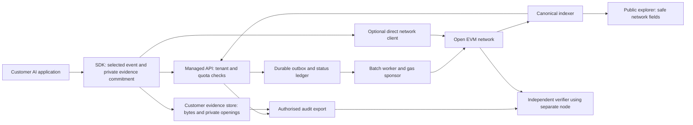

# Product architecture and protocol alignment

> Historical archive — 27 September 2026. Retained for its original scope, not current launch guidance. See the [active documentation](C:/AIChain/docs/README.md).

> Current baseline — 27 September 2026: [Platform current state](C:/AIChain/docs/platform-architecture.md) supersedes dated implementation and launch-status statements below. The governance workspace uses the private VPS API, sponsored Base Sepolia batches and live evidence verification. The 24-hour reliability run is in progress. Production identity, operations, automatic alerting and commercial release remain gated. Historical measurements and protocol semantics retain their original scope.

14 September 2026 · Proposed target · Existing alpha formats remain authoritative until changed by an explicit versioned decision

**20 September architecture refinement:** [the settlement decision analysis](../business/13-settlement-architecture-decision.md) recommends an established public EVM destination. Its stable backend boundaries and finality policy supersede own-mining assumptions in this proposal if adopted. The current receipt commits chain ID and contract address, so a chain change is not merely an RPC switch; retain old signatures and decide versioned destination rules before public SDK freeze. No alpha format has changed in this review.

## Data flow and trust boundaries

The managed API is an untrusted intermediary from the verifier's perspective. It can withhold submission or evidence, but must not be able to alter a customer-signed event without detection. Customer code can still fabricate or omit events. The chain does not solve that source-trust problem.

## 1. Reuse the existing interfaces

Use general Verification Receipt 0.4.0-alpha for new selected-event integrations, initially with the agent or generic profile. Preserve existing 0.1 AVR and 0.2 authorised AVR formats for their established flows. Keep presentation 0.3 semantics separate from receipt schema version. Pin profile definition bytes and signature domain; do not interpret a generic profile as an authority or ZK credential.

The general envelope already binds chain ID and destination contract. Choose the destination before signing. Changing from individual anchoring to a different batch contract changes the receipt identity and requires a new signature; retries must never silently rewrite destination, salts or event identity. Select batching at client configuration time for the managed path.

The receipt commitment root is a SHA-256 digest of the descriptor map. The batch tree uses sorted Keccak pairs over receipt IDs. They are different constructions. Reuse their existing implementations and vectors; do not replace them with a generic Merkle library without compatibility tests.

## 2. Signing and sponsored submission

**Recommended first managed path:** customer-controlled signing adapter creates the receipt signature; the company submits batches and pays their transaction fees. Verify each receipt's signature independently of the batch transaction sender. Persist a per-receipt inclusion path. Keep each customer's deliverable small enough to verify without obtaining other tenants' receipts.

Begin with tenant-separated batches to simplify disclosure and cost reconciliation. Cross-tenant batching is a later optimisation with metadata-leakage and isolation review. A batch of one is acceptable under a low-volume latency policy, although less economical.

`AVRAnchor` records `msg.sender` as issuer and the current individual verifier compares it with the signed receipt issuer. Therefore an operator cannot transparently relay individual customer-issued receipts using its own account. Options are customer direct submission, existing relayed batches, an explicitly operator-issued receipt with weaker attribution, or a future signature-validating relay contract. Do not present the latter two as equivalent to a customer signature.

API credentials authorise use of the commercial service. Receipt keys attest evidence. Relayer keys authorise gas spending. Verifier-governance keys manage proof versions. These require separate storage, access policies and rotation procedures. Keep customer private signing keys outside the API in the default mode; document gateway signing for customers that later opt into managed keys.

## 3. Evidence custody and canonicalisation

Default to exact-byte evidence with random 32-byte private salts using the existing library. Persist bytes, media type, encoding/profile, salt, receipt bytes, signature and event identity together in the customer's store before network submission. Back up salts as carefully as evidence. A lost salt prevents opening the associated commitment.

An ergonomic object API requires an explicitly versioned encoder. It must reject unsupported numeric/Unicode representations and duplicate JSON keys before hashing, with cross-language vectors. The existing alpha canonicaliser is intentionally constrained; it is not a general arbitrary-object standard. Until that adapter exists, examples should explicitly encode bytes and avoid suggesting any Python object can be passed safely.

Managed evidence storage is an opt-in expansion, with tenant-scoped encryption, access checks, retention, export, deletion and restoration drills. Deleting off-chain evidence cannot remove on-chain commitments. Public metadata may remain linkable. Do not claim that hashing alone anonymises data or fulfils a legal requirement.

## 4. Lifecycle and recovery

Maintain three independent state axes:

| Axis | Example states | Meaning |
|---|---|---|
| Submission | accepted, queued, submitted, included, confirmed, reorged, retrying, failed | Where the network workflow stands |
| Verification | passed, failed, unchecked, unsupported, unavailable, expired, revoked | Result of each named check under a specified verifier/policy |
| Evidence | customer-held, available, unavailable, expired, deleted | Whether relevant private openings can be obtained |

Accepted means durable service acceptance, not inclusion. Confirmed means the selected depth in the observed canonical chain, not permanent finality. A reorg can take an included or confirmed receipt back to reorged/queued. Preserve prior observations and notify subscribers; do not conceal the change by replacing the transaction hash in place.

The service uses a transactional outbox and worker leases. Persist intent before broadcast; record transaction hash and sender nonce; recover a crash by checking chain/pending status before sending again. Bound retries, refresh fees under a spend limit, and distinguish uncertain broadcast from confirmed failure. Use a dead-letter queue with a repair record. Never rehash the evidence as part of a network retry.

Reconcile billing from durable unique logical receipt events. Receipt IDs alone may change across legitimate profile versions or chain migrations, so define the business event key and revision policy separately. Corrections create linked new receipts, not rewritten history; corrections and retries have distinct charging rules.

## 5. Independent verification contract

An export includes exact receipt bytes, profile definition/specification, issuer signature and algorithm/domain, chain/genesis/contract identifiers, transaction and canonical block references, batch membership proof if relevant, verification-policy version and observation time. Include private evidence/openings only when expressly authorised. Include proof program/version/public values when a supported proof was performed.

The verifier recomputes identity and commitments; validates profile bytes and signature; checks destination, successful transaction and exact contract event; validates batch membership; reads canonical block hash and current depth; and performs only the authority/proof checks it supports. A production distribution must publish pinned contract addresses and expected bytecode/artifact hashes. A random contract emitting a familiar event is not automatically the intended network contract.

Offline mode can verify bytes, signatures and supplied inclusion material, but must report live canonical-chain status unavailable unless it verifies an adequate independent chain proof. Online mode should support a reviewer-operated full node; a second independent provider can detect disagreements but is not a replacement for consensus validation. Record the source of the observation and last checked height.

## 6. What each claim means

| Proposed claim | Required evidence | What it cannot establish by itself |
|---|---|---|
| Evidence unchanged | Matching byte commitment/opening | Original truth or completeness |
| Signature valid | Correct signature and domain | Trustworthy person/organisation identity |
| Agent authorised | Valid historical authority binding at relevant time | Runtime actually enforced every permission |
| Model identified | Caller metadata, clearly labelled, or independently authenticated provider evidence | A caller-provided model label is not provider attestation |
| Tool event recorded | Signed event plus retained tool evidence | Tool really executed if caller fabricated the record |
| Human approval recorded | Reviewer identity, signed decision, action scope, time and policy | Informed judgement or semantic correctness |
| Policy proof passed | Correct supported proof, program/version and public-input binding | Universal AI safety or accurate model reasoning |
| Workflow links valid | Valid predecessor/session/sequence links | An undisclosed tail or entirely fabricated stream cannot be excluded |
| Included/confirmed | Matching canonical anchor and depth | Irreversible PoW finality or precise execution timestamp |

Return an object of check results, not one global green badge. Existing legacy proof support cannot simply be applied to general receipts. Any extension requires a new statement binding, negative substitution tests, version selection and review.

## 7. Network and proof alignment

Preserve the GPU-PoW/ASERT development track and complete its independent-operator and hardware tests. Measure tail inclusion time, reorg depth, indexer lag and evidence recovery as product requirements alongside throughput. A fast block interval alone cannot satisfy an audit service's reliability requirements.

Use the existing Phase 4 thresholds as development acceptance criteria: 24-hour soak, at least 1,000 observed blocks, configured standard depth 6/high-assurance depth 30, and the existing workload/lag/proof caps. The policy's logical-receipt throughput target is a test gate, not a customer promise. Network depth classes need threat review before production; bridge/irreversible-action depth remains undefined.

Keep ZK work asynchronous and optional. The existing initial proof is a deterministic policy computation, with RISC Zero selected and versioned governance controls. Alpha proof batching does not mean recursive aggregation. Time and charge for proving separately from anchoring. Review proof and journal bytes for information leakage, even if the witness is private.

## 8. Architecture acceptance gate

The prototype anchors use global receipt-ID/batch-root mappings and accept opaque values from any sender. Public-mempool front-running or identifier reservation therefore needs adversarial review: an earlier conflicting submission may block a later intended anchor or bind unexpected metadata. This is a source-derived risk to test, not a reproduced exploit in this review. Include competing submissions, conflicting issuer/root metadata and already-anchored recovery in public-release testing. If a new signature-validating or namespaced anchor is needed, introduce a reviewed contract/version while retaining historical verification; it is not automatically a consensus change.

Before a customer pilot: demonstrate a customer-signed batch submission; stop/restart at each outbox/broadcast/indexing boundary; export and verify through a separate node; tamper with evidence/signature/profile/chain/contract and observe failure; withhold evidence and observe unavailable; simulate reorg and recover without duplicate billing; prove no private openings appear in public responses or logs.

No minimum consensus change is identified for this product slice. Contract and profile improvements may still be warranted after live tests. Record those as scoped application-protocol decisions, with compatibility and migration evidence, instead of broad core-chain refactoring.

## 9. Agent safety integration boundary

An additive safety profile can record policy snapshots, monitor alerts, selected tool requests and human interventions. A local policy gateway, sandbox, SIEM/EDR or agent runtime must make allow/block/pause/revoke decisions synchronously. The receipt outbox records those results afterwards; network confirmation is evidence, never the control mechanism. Keep sensitive payloads off-chain and return separate checks for policy binding, monitor signature, intervention authority, sequence continuity and anchor inclusion. The product and messaging recommendation is in [AI safety, monitoring and verification positioning](../business/07-ai-safety-monitoring-positioning.md).

## 10. Distributed-ledger security claim

The verification network is designed to make a recorded commitment harder to alter retrospectively because verification does not rely solely on one company-controlled database. An attacker who compromises one platform account, database or operational team should not be able to silently rewrite a record already confirmed by independent network participants and independently rechecked by a reviewer.

That is a resilience and tamper-evidence claim, **not** a claim that blockchains are “AI-resistant.” An AI-assisted attacker can still compromise signing keys, fabricate source events, exfiltrate private evidence, exploit a weak runtime, attack a relayer/indexer, exploit smart-contract bugs, influence/collude with network participants or target consensus economics. The protection depends on the actual decentralisation, confirmation policy, key management, contract security, node diversity and reviewer independence. No single confirmed receipt proves complete monitoring or agent safety.

Approved short wording: “An independently verifiable, tamper-evident record that does not depend solely on the AI operator’s database.” Avoid “immutable AI safety ledger”, “AI-proof blockchain” and “impossible to alter.”
