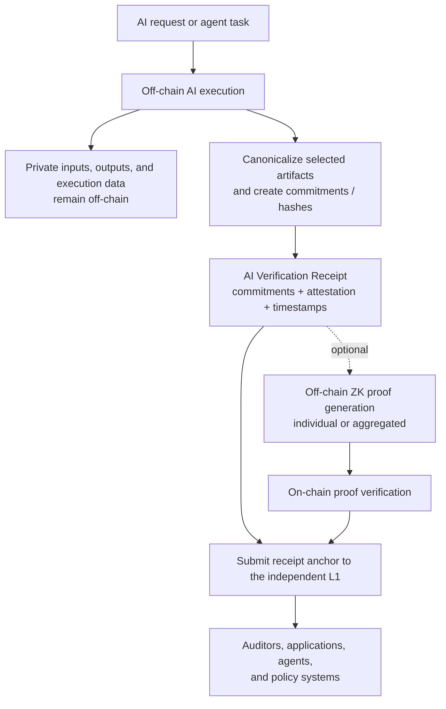

# AI Verification & ZK Architecture

| Field | Value |
|---|---|
| Status | Living design document |
| Document version | 0.6 |
| Last updated | 2026-08-22 |
| Protocol/schema version | **TBD** |
| Decision state | Product direction agreed; unresolved items are marked **TBD** |
| Companion document | [Core L1 Architecture and Tooling](./core-l1-architecture-and-tooling.md) |

## 1. Purpose

The **AI Verification Receipt (AVR) layer is the core product**. It provides a standard way to commit to, attest to, timestamp, and optionally prove defined facts about AI activity on the independent L1.

AI inference and agent execution remain off-chain. The chain records the verification anchor and verifies supported ZK proofs; it does not rerun the AI workload.

## 2. Agreed Direction

| Area | Direction | Status |
|---|---|---|
| Product focus | AI Verification Receipts, evolving toward a general Verification Receipt primitive for autonomous machines | AVR is agreed; broader profiles are product direction and schema TBD |
| AI execution | Off-chain | Agreed |
| Evidence | Commitments/hashes, execution attestations, and timestamps | Agreed; exact formats TBD |
| Committed context | Model, provider, configuration, and policy; input/output artifacts as applicable | Agreed direction; schema TBD |
| ZK proofs | Optional; individual and aggregated proofs may be supported | Agreed direction; design TBD |
| Proof generation | Off-chain | Agreed |
| Proof verification | On-chain | Agreed; verifier interface TBD |
| Privacy | Minimize public data and keep sensitive AI content off-chain | Agreed principle |
| Candidate ZK stacks | RISC Zero, SP1, and Halo2 | Evaluation items only; none selected |

## 3. Logical Flow



The exact division between transaction input, contract or protocol state, logs/events, and external data references is **TBD**.

### 3.1 Phase 1B Prototype Boundary

The Phase 1B prototype uses a versioned **Solidity event-and-state anchor contract** rather than a Core-Geth protocol modification. It accepts only a receipt identifier, a commitments root, and a schema version; the submitting EVM account is recorded as the prototype issuer. Raw AI artifacts, model/provider names, configuration values, policies, signatures, and ZK proofs are excluded from the transaction.

This is an implementation experiment, not a resolution of **AVR-001** through **AVR-006** or a final decision about native placement, hash construction, or attestation trust. A later version may use a new contract, a migration record, or a native protocol mechanism.

### 3.2 Authorised AVR Prototype Boundary

The additive `0.2.0-draft` Authorised AVR prototype binds an opaque organisation ID and authority commitment to a receipt. Its companion contract checks that the submitting wallet has an active, matching `AuthorityRegistry` delegation at submission time. It does not validate credential signatures, the committed policy/configuration, a real-world identity, or historical authorisation semantics. See [Authorised AVR Prototype](./authorised-avr-prototype.md).

## 4. AI Verification Receipt

An AVR binds an AI execution to a defined set of evidence. The final schema and verification rules remain open.

### 4.1 Logical Content

| Item | Purpose | Design state |
|---|---|---|
| Input commitment | Binds the receipt to a request, prompt, context, or other execution input | Exact scope and encoding TBD |
| Output commitment | Binds it to a response, action, or artifact | Exact scope and encoding TBD |
| Model commitment | Binds it to the declared model identity, version, or model artifact | Encoding and disclosure policy TBD |
| Provider commitment | Binds it to the declared provider or execution service | Encoding and disclosure policy TBD |
| Configuration commitment | Binds parameters, tools, runtime settings, or other relevant configuration | Contents TBD |
| Policy commitment | Binds the policy or rule set associated with execution | Contents TBD |
| Execution attestation | Identifies who or what attests that execution occurred | Trust and signature model TBD |
| Execution timestamp | Records a claimed execution time and its source | Source and semantics TBD |
| ZK proof data/reference | Optionally associates an individual or aggregated proof | Format and storage TBD |
| Chain anchor | Adds transaction and block inclusion details after submission | Format TBD |
| Identity/authority commitment or reference | Binds an organisation, agent, model, machine, delegated authority, or credential where relevant | Profile, trust, and revocation rules TBD |
| Approval commitment or reference | Binds a required human or system approval where relevant | Scope and verification rules TBD |

The canonical encoding, required versus optional fields, hash or commitment construction, field sizes, and receipt identifier derivation are all **TBD**.

### 4.2 Assurance Boundaries

A receipt is evidence for explicitly defined claims. It is not automatically proof that:

- an AI output is correct, safe, or high quality;
- a declared provider or model was genuinely used;
- an attester is trustworthy;
- a claimed execution timestamp is independently authoritative; or
- private data satisfies a policy.

Those claims need an appropriate attestation trust model, a precisely defined ZK statement, or both. Verification policy must distinguish an unproved receipt, an individually proved receipt, and a receipt covered by an aggregate proof.

## 5. Commitments, Attestations, and Time

Commitments bind a receipt to off-chain artifacts without publishing those artifacts. Model, provider, configuration, and policy commitments should remain logically distinct so verifiers can reason about each claim.

A commitment is not encryption. Predictable or low-entropy values may be guessable, so canonicalization, domain separation, salting or blinding, and disclosure rules must be defined before the schema is finalized.

An execution attestation associates an issuer with the receipt. The issuer identity model, signature scheme, authorization rules, revocation approach, and trust assumptions are **TBD**.

### 5.1 Identity and Authority Prototype Boundary

`AuthorityRegistry` is a Phase 1B contract-level experiment that registers an opaque organisation ID to a controller EVM wallet, then lets that controller create or revoke time-bounded agent-wallet delegations with opaque authority commitments. It does not resolve the identity, credential, delegation, revocation, or authority decisions in this document, and it is not yet bound to AVR receipt validation. See [Identity and Authority Prototype](./identity-and-authority-prototype.md).

The design distinguishes three times:

| Time | Meaning |
|---|---|
| Execution time | Claimed by an attester or another time source; trust model TBD |
| Submission time | When the receipt is submitted to the network |
| Inclusion time | Derived from the block containing the receipt |

A block timestamp establishes inclusion under the chain's rules; by itself, it does not prove when the off-chain execution occurred.

## 6. ZK Architecture

### 6.1 Generation and Verification

| Stage | Location | Responsibility |
|---|---|---|
| Proof generation | Off-chain | Use private witness data to prove a versioned statement over defined public inputs; may produce an individual or aggregated proof |
| Proof verification | On-chain | Verify a supported proof against its public inputs and record the result without rerunning the AI workload |

A ZK proof establishes only the statement encoded by its program or circuit and the inputs bound to that statement. It does not establish broader AI correctness unless that property is explicitly represented and proved.

Receipts without proofs remain possible, but have a different assurance level. The prover role, proof statement, public inputs, verifier interface, aggregation design, limits, and upgrade policy are **TBD**.

### 6.2 Candidate Stacks

These are evaluation candidates, not selected components:

| Candidate | Category | Status |
|---|---|---|
| RISC Zero | zkVM candidate | Evaluate |
| SP1 | zkVM candidate | Evaluate |
| Halo2 | Circuit/proving-framework candidate | Evaluate |

Evaluation should cover proof-generation performance, on-chain verification cost, aggregation or recursion support, developer complexity, security maturity, tooling, and L1/EVM integration. No candidate should be presented as chosen until an explicit decision is recorded.

## 7. Privacy Principles

- Keep raw prompts, private context, outputs, credentials, and proprietary policy material off-chain.
- Publish only the commitments and public inputs needed for the intended verification claim.
- Treat commitments as binding references, not confidentiality guarantees.
- Use appropriate salting, blinding, or hiding commitments where predictable values could be guessed; the exact construction is TBD.
- Make every disclosed field intentional because on-chain data is persistent.
- Keep private artifact storage, access control, availability, and retention separate from the chain anchor.
- Define exactly what each proof reveals before deployment.
- Do not claim privacy, provenance, or correctness beyond what the chosen commitment, attestation, and proof design establishes.

## 8. Capacity, Batching, and Aggregation Requirements

The network is intended to handle high-volume verification submissions. Scalability must therefore be designed and measured at every implementation stage, rather than deferred until after a receipt interface is fixed.

Potential mechanisms include individual anchors, batched receipt roots, off-chain queues, proof aggregation, recursive proofs, and later data-availability or parallel-ingestion approaches. None is selected by this document.

Every proposed mechanism must state:

- the receipt workload and payload assumptions;
- what is included directly on-chain versus represented by a batch root or proof;
- submission, inclusion, confirmation, and verification latency definitions;
- throughput, fee, block-space, state-growth, and indexer implications;
- P2P propagation, reorganization, withholding, replay, data-availability, and censorship risks; and
- fallback, retry, audit, and individual-receipt verification behavior.

A batch or rollup may improve efficiency, but it must not overstate assurance: a receipt covered only by a batch commitment or proof needs clear inclusion and verification semantics.

## 9. Receipt Profiles and Use Cases

The initial AVR targets off-chain AI activity. The receipt architecture is also intended to support versioned profiles for enterprise agents, agent-to-agent interactions, AI-generated-content provenance, AI supply chains, robotics, vehicles, drones, and other autonomous machines. See [Autonomous Machines Product Vision](./autonomous-machines-product-vision.md).

Each profile must define its own evidence boundary, identity/authority semantics, threat model, and assurance language. For example, a content receipt can establish provenance, not factual correctness; a vehicle receipt can bind disclosed incident evidence to a historical anchor, not prove safety or assign liability by itself.

Full cryptographic proof of frontier-model inference is not an initial requirement. Initial proof exploration focuses on the wrapper around AI or machine activity: identity, configuration, policy, authority, approval, and committed evidence.

## 10. Illustrative Verification Receipt

This sample is **non-normative**. It shows the intended information categories only. Field names, encodings, required fields, and storage locations are **TBD**.

```json
{
  "schema": "ai-verification-receipt",
  "schema_version": "TBD",
  "receipt_id": "<derivation TBD>",
  "commitments": {
    "input": "<commitment>",
    "output": "<commitment>",
    "model": "<commitment>",
    "provider": "<commitment>",
    "configuration": "<commitment>",
    "policy": "<commitment>"
  },
  "execution": {
    "claimed_at": "<ISO-8601 timestamp>",
    "timestamp_source": "<TBD>"
  },
  "attestation": {
    "issuer": "<identity or key reference>",
    "scheme": "<TBD>",
    "signature": "<signature>"
  },
  "zk": {
    "mode": "aggregate",
    "system": "<TBD>",
    "statement_version": "<TBD>",
    "batch_id": "<batch identifier>",
    "proof": "<inline proof or reference; TBD>",
    "public_inputs": "<TBD>"
  },
  "chain_anchor": {
    "transaction_hash": "<set after submission>",
    "block_number": "<set after inclusion>",
    "included_at": "<chain timestamp>"
  }
}
```

For an unproved receipt, the `zk` section may be absent or may explicitly state that no proof is attached. The final convention is **TBD**.

## 11. Open Decisions

| ID | Decision | Status |
|---|---|---|
| AVR-001 | Canonical receipt schema and required versus optional fields | TBD |
| AVR-002 | Canonical serialization and receipt identifier derivation | TBD |
| AVR-003 | Hash/commitment scheme, domain separation, and salting or blinding rules | TBD |
| AVR-004 | Attester identity, signature, authorization, revocation, and trust model | TBD |
| AVR-005 | Timestamp sources and verification semantics | TBD |
| AVR-006 | On-chain anchor format, events/indexing, and external data references | TBD |
| ZK-001 | Exact statements and public inputs to prove | TBD |
| ZK-002 | ZK stack selection: RISC Zero, SP1, Halo2, or another evaluated option | TBD |
| ZK-003 | Individual and aggregate proof design | TBD |
| ZK-004 | On-chain verifier integration, cost limits, upgrades, and security review | TBD |
| PRIV-001 | Disclosure profiles and off-chain storage, access, and retention model | TBD |
| AVR-007 | Versioned receipt profiles for AI and autonomous-machine domains | TBD |
| ID-001 | Identity model for organisations, agents, models, and machines | TBD |
| ID-002 | Credential issuance, delegation, authorization, and revocation model | TBD |
| ID-003 | Configuration, policy, and authority reference/registry model | TBD |
| ZK-005 | Initial private policy/authority claims eligible for ZK evaluation | TBD |
| SCALE-001 | Receipt batching, aggregation, recursion, and throughput strategy | TBD |
| SCALE-002 | Workload, confirmation-latency, block/state/indexer-growth, and capacity targets | TBD |
| ARCH-002 | Enterprise deployment model | Agreed: Organisation Verification Ledger (OVL) plus AIChain anchoring is the default; customer-specific private L1 is deferred. See [ADR-0002](./decisions/0002-organisational-verification-ledger.md). |
| AVR-008 | Profile-based receipt architecture | Agreed direction; canonical object schema remains TBD. |
| AVR-009 | Assurance presentation | Agreed: present distinct evidence dimensions; do not use a generic “verified” claim. |
| PRIV-002 | OVL privacy baseline | Agreed: private evidence remains in the organisation boundary; public L1 anchors commitments/checkpoint metadata only. |
| SCALE-003 | OVL anchor hierarchy | Agreed direction: receipt → Merkle batch → signed checkpoint → L1 anchor; detailed limits TBD. |
| CRYPTO-001 | Crypto agility | Agreed direction: suite IDs, key rotation, migration/re-signing records, and versioned reports; suites remain TBD. |

## 12. Maintenance Rules

- Keep document versioning separate from the future AVR protocol/schema version.
- When an open decision is resolved, update the relevant architecture section and decision row together.
- Record the decision reference and date in the change log.
- Keep agreed choices separate from candidates and evaluation items.
- Preserve assurance and privacy boundaries as implementation details evolve.

## 13. Change Log

| Version | Date | Change | Decision reference |
|---|---|---|---|
| 0.1 | 2026-08-16 | Initial AVR and ZK architecture baseline | Agreed core product direction |
| 0.2 | 2026-08-19 | Recorded versioned, contract-level Phase 1B prototype boundary | Prototype only; AVR decisions remain TBD |
| 0.3 | 2026-08-19 | Expanded product scope to autonomous-machine receipt profiles and identity/authority use cases | Product direction; decisions remain TBD |
| 0.4 | 2026-08-19 | Recorded contract-level identity and authority prototype boundary | ID-001–003 and AVR-004 remain TBD |
| 0.5 | 2026-08-19 | Added mandatory capacity, batching/rollup, and aggregation evaluation requirements | SCALE-001–002 remain TBD |
| 0.6 | 2026-08-22 | Accepted organisational-ledger, privacy, assurance, scaling, and crypto-agility directions | ADR-0002; detailed protocol values remain TBD |
| 0.7 | 2026-08-22 | Added additive authorised-AVR prototype boundary | Development-only; final credential/trust decisions remain TBD |
| X.Y | YYYY-MM-DD | Describe the change | Decision ID or link |
