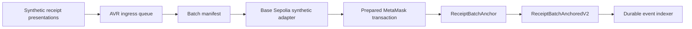

# Base Sepolia ingress alpha

## Current boundary

The queue can now produce batch manifests and the `BaseSepoliaSyntheticBatchAdapter` converts an **explicitly synthetic** batch into a reviewed `anchorBatch` transaction for the deployed Base Sepolia contract. The adapter does not contain a private key, connect a wallet, broadcast, or accept a batch unless its caller marks it `synthetic: true`.

This keeps the integration path useful without implying that the hosted API is ready to receive customer evidence. Production ingress requires tenant authentication, retention controls, durable job storage, monitoring, a reviewed relayer policy, and an independent security review.

## Flow

## Usage

Instantiate the adapter with the deployed contract and an approved publisher address, then pass a drained queue batch with `synthetic: true`. It returns the Base chain binding, publisher-scoped batch ID, enriched manifest and zero-value calldata. The local MetaMask page remains the only current write path.

The adapter's contract/chain binding is tested locally. The prior synthetic Base transaction proves the downstream event and indexer path. Do not remove the synthetic gate until the service launch gates above are accepted.

## Durable service boundary

`services/ingress/synthetic-ingress-service.js` adds the current development service shape: API-key authentication, a file-backed queue snapshot, explicit synthetic admission, batch preparation, and later receipt-result recording. It has no HTTP listener, key custody, or broadcast code. Its API key and state-file location must be supplied by the host and are not repository configuration.

`services/ingress/synthetic-ingress-http.js` exposes that service only on loopback. `GET /health` reports queue state and counters; `POST /v1/synthetic/receipts` accepts an authenticated synthetic presentation; `POST /v1/synthetic/batches/prepare` returns prepared Base calldata; and `POST /v1/synthetic/batches/{queueBatchId}/result` durably reconciles a verified inclusion or retry outcome. Logs contain only an event name, result, receipt ID or batch count — never the full presentation. Start it with `AICHAIN_SYNTHETIC_API_KEY` set, using `npm run base:synthetic-ingress`.

## Test progression

The local regression suite submits two distinct synthetic presentations through the HTTP boundary, forces a batch, verifies the prepared Base transaction, and confirms durable queue state without broadcasting. `npm run test:base-synthetic-e2e` is a separate read-only live check of the recorded Base Sepolia synthetic transaction, V2 event and indexer lookup. Neither test creates an on-chain transaction.
