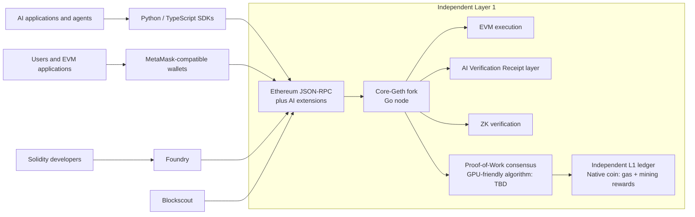

# Core L1 Architecture and Tooling

| Field | Value |
|---|---|
| Status | Living design document |
| Document version | 0.1 |
| Last updated | 2026-08-16 |
| Decision state | Core architecture agreed; unresolved items are marked **TBD** |
| Scope | Base-layer architecture, protocol foundation, and primary tooling |
| Companion document | [AI Verification & ZK Architecture](./ai-verification-and-zk-architecture.md) |

## 1. Architecture Summary

This project is an **independent Layer 1 blockchain**. It will operate its own Proof-of-Work consensus and settle transactions on its own chain. It is **not an Ethereum Layer 2** and does not depend on Ethereum for consensus or settlement.

The implementation will begin as a **fork of Core-Geth**, retain the **Ethereum Virtual Machine (EVM)**, and use Ethereum-compatible development and user tooling where practical. Its distinguishing product layer is the **AI Verification Receipt (AVR) layer**, with ZK verification support, described in the companion document.

## 2. Agreed Architecture and Tooling

| Area | Choice | Purpose | Status |
|---|---|---|---|
| Network classification | Independent Layer 1 | Independent consensus and settlement | Agreed |
| Node foundation | Core-Geth fork | Starting point for the L1 client | Agreed |
| Node implementation | Go | Matches the Core-Geth codebase | Agreed |
| Execution | EVM | Solidity contracts and Ethereum-compatible tooling | Agreed |
| Consensus | Proof of Work | Secures the independent network | Agreed |
| Mining algorithm | GPU-friendly PoW | Permissionless GPU-based block production | **TBD: exact algorithm** |
| Native asset | Native L1 coin | Gas and mining rewards | Agreed; economics TBD |
| Smart contracts | Solidity | Application contract language | Agreed |
| Contract development | Foundry | Build, test, and deploy Solidity contracts | Agreed |
| Wallet compatibility | MetaMask-compatible | Standard EVM wallet workflows | Agreed |
| Node API | Ethereum JSON-RPC plus AI extensions | Standard EVM access and AI-specific functions | Agreed; extension schema TBD |
| Client SDKs | Python and TypeScript | AI and application integrations | Agreed |
| Explorer | Blockscout | EVM-compatible chain explorer | Agreed |
| Product layer | AI Verification Receipts and ZK verification | Anchors and verifies claims about off-chain AI activity | Agreed; detailed design TBD |

## 3. High-Level Architecture

Simplified transaction flow:

1. Wallets, applications, and AI systems submit standard EVM transactions or AI-specific requests through the compatible API surface.
2. The Core-Geth-derived Go node executes EVM transactions and processes AVR and proof-verification operations.
3. GPU miners produce blocks under the network's PoW rules.
4. The independent L1 settles the resulting transactions, receipts, and verification results in its own ledger.
5. Blockscout indexes chain data for inspection.

## 4. System Boundaries

- **Independent settlement:** Ethereum-compatible technology does not make the network an Ethereum L2.
- **EVM scope:** The EVM provides Solidity execution and compatibility with established Ethereum tooling.
- **AI execution:** AI workloads run off-chain. The chain anchors and verifies receipts, commitments, attestations, and supported proofs; it does not run the AI workload.
- **Mining:** Proof of Work is agreed. The exact GPU-friendly mining algorithm is not selected.
- **Native coin:** Use for gas and mining rewards is agreed. Supply, issuance, reward schedule, denomination, and other economic parameters are TBD.
- **API compatibility:** Ethereum JSON-RPC plus AI extensions is agreed. Exact extension methods, parameters, and lifecycle rules are TBD.
- **ZK implementation:** ZK verification is part of the architecture. The proof system and verifier design remain evaluation items in the companion document.

## 5. Open Decisions

| ID | Decision | Status | Notes |
|---|---|---|---|
| L1-001 | Select the GPU-friendly PoW algorithm | TBD | No mining algorithm has been chosen |
| L1-002 | Select the Core-Geth fork baseline and define required protocol changes | TBD | Core-Geth is agreed; exact baseline is not |
| L1-003 | Define genesis and network parameters | TBD | Includes chain ID, block timing, gas parameters, and related settings |
| L1-004 | Define native coin economics | TBD | Only its gas and mining-reward roles are agreed |
| L1-005 | Define AI-specific JSON-RPC methods | TBD | Must follow the AVR architecture |

No option should be treated as selected until it is explicitly recorded as an agreed decision.

## 6. Maintenance Rules

- Update the document version and date when an agreed choice or open decision changes.
- Keep agreed decisions separate from candidates and evaluation items.
- Mark unresolved matters as **TBD**.
- Record implementation details as settled only after an explicit decision.
- Keep detailed AVR, privacy, and ZK design in the companion document, linking back here when it affects the base protocol.

## 7. Change Log

| Version | Date | Change | Decision reference |
|---|---|---|---|
| 0.1 | 2026-08-16 | Initial architecture and tooling baseline | Agreed core product direction |
| X.Y | YYYY-MM-DD | Describe the change | Decision ID or link |

