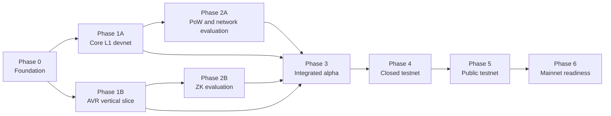

# Development Plan

| Field | Value |
|---|---|
| Status | Living delivery plan |
| Document version | 0.3 |
| Last updated | 2026-08-18 |
| Architecture inputs | [Core L1 Architecture and Tooling](./core-l1-architecture-and-tooling.md); [AI Verification & ZK Architecture](./ai-verification-and-zk-architecture.md) |
| Schedule | Dates, durations, staffing, and owners are **TBD** |
| Decision state | This plan sequences open decisions; it does not settle them |

## 1. Objective

Deliver an independent, Core-Geth-derived, EVM-compatible Proof-of-Work L1 whose core product is the **AI Verification Receipt (AVR) layer**, evolving through versioned profiles toward verification for autonomous agents and machines. Proofs are generated off-chain and supported ZK proofs are verified on-chain.

This plan does **not** select the mining algorithm, Core-Geth baseline, chain parameters, coin economics, AVR schema, attestation model, proof statements, or ZK stack. Those choices must pass the decision gates in this document and then be recorded in the architecture documents.

## 2. Delivery Principles

- **AVR-first:** Validate the receipt lifecycle early; the chain is the settlement and verification platform for that product.
- **Prototype before protocol commitment:** Test formats and workflows using the least-invasive EVM-compatible approach before deciding what belongs in contracts, node code, precompiles, or RPC extensions.
- **Minimize fork divergence:** Keep changes to the Core-Geth-derived client isolated, documented, and covered by compatibility tests.
- **Deterministic across implementations:** Go, Python, TypeScript, and Solidity components must share canonical test vectors where they process the same data.
- **Privacy and security throughout:** Threat modelling, data-disclosure review, fuzzing, and adversarial tests are continuous workstreams, not final-stage checks.
- **Evidence-based decisions:** Benchmarks and prototypes inform choices, but a temporary configuration does not close a decision gate.
- **Quantum-resilience requirement:** The PoW selection must include a documented quantum-threat assessment and rationale. This is distinct from any future decision on wallet/account signature migration.
- **Version everything public:** Receipt schemas, proof statements, verifier interfaces, RPC extensions, SDKs, and network releases require explicit versions.
- **Profile before expansion:** Each new domain—such as agents, robots, vehicles, drones, or content provenance—requires an explicit receipt profile, assurance boundary, privacy review, and threat model before implementation.

## 3. Target End-to-End Product Slice

The first complete technical slice should demonstrate:

1. An off-chain AI execution produces selected commitments, an execution attestation, and timestamp data without placing raw private artifacts on-chain.
2. Python and TypeScript SDKs produce the same receipt identifier and commitments from common test vectors.
3. A receipt can be submitted to and retrieved from a Core-Geth-derived PoW development network.
4. Standard EVM transactions and Solidity contracts work through Ethereum JSON-RPC, Foundry, and MetaMask-compatible workflows.
5. Both unproved and proved receipts have explicit, distinguishable assurance states.
6. A supported proof can be generated off-chain, bound to the intended receipt/public inputs, and verified on-chain.
7. Blockscout can index the underlying chain data; the final receipt-specific display design remains **TBD**.

This slice is a development milestone, not a mainnet specification. Temporary development parameters must be clearly labelled.

## 4. Workstreams and Dependencies

Security, privacy, compatibility, documentation, and operations run across every phase.

## 5. Phased Development Plan

### Phase 0 — Foundation and Decision Framework

**Goal:** Establish a reproducible engineering baseline and stop open choices becoming accidental protocol decisions.

**Primary outputs**

- Core-Geth baseline assessment and protocol-change map.
- Build, test, versioning, release, and decision-record conventions.
- Baseline EVM and Ethereum JSON-RPC compatibility results.
- Initial threat model, privacy review checklist, performance baselines, and risk register.
- Traceable backlog mapped to the open-decision IDs in the architecture documents.

**Exit gate**

- **L1-002** is resolved and recorded.
- The selected baseline builds and tests reproducibly in a clean environment.
- Planned changes are classified as consensus, execution, networking/API, AVR, ZK, or tooling changes.
- Every unresolved choice remains visibly marked **TBD**.

### Phase 1A — Core L1 Development Network

**Goal:** Bring up the smallest usable independent development chain while preserving the agreed EVM tooling surface.

**Primary outputs**

- Buildable Core-Geth-derived Go node.
- Reproducible local multi-node network and genesis process.
- EVM and standard Ethereum JSON-RPC regression suite.
- Foundry contract deployment and transaction tests.
- MetaMask-compatible connection and transaction workflow.
- Initial Blockscout compatibility spike.
- Clearly labelled development-only mining, gas, reward, and network parameters.

**Exit gate**

- Nodes start from the same genesis, connect, produce blocks, synchronize, restart, and recover.
- Solidity contracts can be deployed and called through Foundry.
- MetaMask-compatible wallets can submit transactions and display the native balance used for gas.
- Standard RPC behavior remains compatible with the recorded baseline.
- Development parameters are not presented as resolving **L1-001**, **L1-003**, or **L1-004**.

### Phase 1B — AVR Specification and Vertical Slice

**Goal:** Validate the core product lifecycle before stable APIs and native protocol changes depend on it.

**Primary outputs**

- Draft versioned AVR schema and assurance-level definitions.
- Canonical serialization, receipt-ID derivation, and commitment test vectors.
- Draft attestation, authorization/revocation, and timestamp semantics.
- Draft disclosure profiles and off-chain storage/access/retention boundary.
- Contract/event-based anchoring prototype for testing semantics; this does not settle final on-chain placement.
- Python and TypeScript prototypes for receipt creation, submission, lookup, and local verification.
- End-to-end flow from off-chain execution fixture to chain inclusion and retrieval.
- Profile-design criteria for identity, authority, configuration, policy, approval, and machine evidence; no registry or credential system is presumed by this phase.

**Exit gate**

- Go, Python, and TypeScript fixtures produce identical identifiers and commitments.
- Covered field changes, malformed data, invalid signatures, and replay attempts are detected as defined.
- Raw prompts, outputs, credentials, and private context are not required on-chain.
- Execution, submission, and inclusion times remain distinct.
- Receipt submission and lookup work using standard Ethereum interfaces before AI-specific RPC methods are frozen.

### Phase 2A — PoW, Network, and Native-Coin Evaluation

**Goal:** Replace temporary development assumptions with measured and explicitly approved network rules.

**Primary outputs**

- GPU-friendly PoW candidate criteria, prototypes, benchmarks, and recommendation, including a documented quantum-threat assessment and quantum-resilience rationale.
- Difficulty/work, fork-choice, reorganization, timestamp, pool/centralization, and denial-of-service analysis.
- Analysis of anticipated quantum speedups, security assumptions, and any required future upgrade or migration posture for the selected PoW design.
- Candidate genesis, chain, gas, issuance, and mining-reward specifications.
- Consensus vectors, invalid-block tests, reward/supply invariants, and mining workflow.

**Exit gate**

- **L1-001** is resolved before the mining algorithm is treated as final; its decision record must include the quantum-threat assessment and rationale.
- **L1-003** and **L1-004** are resolved before non-development network and economic parameters are frozen.
- Valid work and rewards are accepted consistently; invalid work, rewards, and transitions are rejected deterministically.
- Competing-chain, reorganization, restart, and synchronization behavior passes the agreed tests.

### Phase 2B — ZK Statement and Stack Evaluation

**Goal:** Select a ZK approach against precise AVR claims and measurable requirements.

**Primary outputs**

- Versioned candidate proof statement(s), public inputs, assurance claims, and threat model.
- Comparable prototypes and benchmarks for RISC Zero, SP1, and Halo2 where applicable.
- Measurements covering proving time, memory, proof size, verifier cost, aggregation/recursion, tooling, maturity, and integration complexity.
- Recorded stack recommendation and rationale.
- Off-chain prover and on-chain verifier prototype bound to an AVR.
- Aggregation design or an explicit decision to defer it from the initial release.

**Exit gate**

- **ZK-001** is resolved before a prototype is described as a product proof.
- **ZK-002** is resolved before production integration.
- Valid proofs verify against the intended receipt and public inputs; altered, malformed, substituted, and wrong-version proofs fail.
- Public documentation states exactly what the proof does and does not establish.
- **ZK-003** and **ZK-004** are resolved to the level required by the chosen release scope.
- Any initial private authority or policy claim is explicitly scoped under **ZK-005**; proof of frontier-model inference remains out of the initial release scope.

### Phase 3 — Integrated Alpha

**Goal:** Combine the L1, AVR, SDK, proof, and explorer work into one reproducible internal release.

**Primary outputs**

- Core-Geth-derived network using the selected alpha consensus configuration.
- Versioned AVR implementation and on-chain anchor.
- Versioned AI-specific JSON-RPC draft based on the validated receipt workflow.
- Python and TypeScript SDK alpha releases.
- Initial supported ZK prover/verifier path.
- MetaMask, Foundry, and Blockscout integration.
- End-to-end examples for both proved and unproved receipts.

**Exit gate**

- A clean environment can deploy the network and complete the target product slice.
- Receipt and proof version mismatches are handled deterministically.
- RPC, receipt, proof, and transaction resource limits are defined and enforced for the alpha.
- Indexer resynchronization, duplicate submission, and chain-reorganization behavior are tested.
- The remaining **L1-005** AI RPC decisions are resolved before the public API is frozen.

### Phase 4 — Closed Testnet and Hardening

**Goal:** Exercise the integrated system under controlled, realistic, and adversarial conditions.

**Primary outputs**

- Reproducible closed-testnet deployment and reset/upgrade process.
- Node synchronization, fault, partition, reorganization, and recovery reports.
- Load, spam, malformed AVR/proof, verifier-cost, and RPC denial-of-service tests.
- Consensus, Go, Solidity, SDK, and verifier fuzzing results.
- Privacy review of all on-chain fields and ZK public inputs.
- Monitoring, incident response, backup/recovery, and key-handling runbooks.
- External security-review scope and release acceptance targets.

**Exit gate**

- Reliability, performance, cost, and security thresholds are defined before the phase closes; exact values are **TBD**.
- Upgrade, recovery, indexer resync, and version-migration exercises succeed.
- Critical security findings are resolved and accepted residual risks are documented.
- Testnet economics and resource controls make receipt/proof spam measurable and manageable.

### Phase 5 — Public Testnet

**Goal:** Validate open participation, mining, integrations, and operations before any mainnet decision.

**Primary outputs**

- Public testnet node, miner, SDK, explorer, and integration releases.
- Operator, miner, developer, verifier, and auditor documentation.
- Monitoring, support, incident, upgrade, and explicit testnet-reset procedures.
- Public compatibility and migration tests for supported receipt and proof versions.
- External security assessment and remediation cycle.

**Exit gate**

- The network meets documented reliability and performance targets over the agreed observation period; both remain **TBD** until set.
- Mining, node operation, receipt submission, proof verification, SDK use, and explorer indexing work outside the core development environment.
- No unresolved architecture item is silently represented as a mainnet value.
- Launch-blocking security findings and operational gaps are resolved.

### Phase 6 — Mainnet Readiness

**Goal:** Produce a reviewable release candidate and an explicit go/no-go decision. This phase does not presume a launch date.

**Primary outputs**

- Final candidate genesis, network parameters, native-coin rules, and supported protocol versions.
- Versioned node, SDK, AVR schema, verifier, and explorer release candidates.
- Reproducible builds, checksums, release notes, and operator/user documentation.
- Security-review outcomes, known limitations, risk acceptance, upgrade/rollback procedures, and launch checklist.
- Documented governance and authority boundaries for upgrades and verifier changes; exact model is **TBD**.

**Exit gate**

- Release artifacts reproduce from tagged source and pass the full acceptance suite.
- Documentation matches observable behavior and separates commitments, attestations, and proved claims accurately.
- No launch-blocking architecture or security decision remains **TBD**.
- An authorized go/no-go review is recorded before any mainnet launch.

## 6. Decision Gates

| Gate | Decisions | Required before |
|---|---|---|
| DG-1 | **L1-002** Core-Geth baseline and change boundary | Core client development diverges from the baseline |
| DG-2 | **AVR-001–006** and **PRIV-001** | Stable AVR schema, SDK contracts, and anchoring behavior |
| DG-3 | **L1-001** mining algorithm and quantum-resilience assessment | Consensus configuration is frozen |
| DG-4 | **L1-003** and **L1-004** network/genesis and economics | A non-development genesis candidate is frozen |
| DG-5 | **L1-005** AI RPC methods | Public AI API and SDK interfaces are frozen |
| DG-6 | **ZK-001** proof statements and public inputs | Candidate implementations are described as product proofs |
| DG-7 | **ZK-002–004** stack, aggregation scope, verifier, and upgrades | ZK release scope is frozen |
| DG-8 | Testnet targets, supported versions, security findings, and residual risks | Mainnet release-candidate approval |
| DG-9 | **ID-001–003**, **AVR-007**, and applicable domain threat model | A machine-identity/authority or autonomous-machine profile is released |

A gate closes only when its decision is recorded in the relevant architecture document or decision record. A benchmark, prototype, or temporary configuration does not close a gate.

## 7. Cross-Cutting Validation

| Area | Minimum validation |
|---|---|
| Core client | Upstream/baseline regression tests, reproducible builds, EVM and RPC compatibility tests |
| Consensus | Valid/invalid block vectors, reward/supply invariants, reorganization, partition, restart, and synchronization tests |
| AVR | Cross-language golden vectors, malformed inputs, tampering, replay, signature, versioning, and reorganization behavior |
| Privacy | Per-field disclosure review, low-entropy commitment analysis, private-data boundary tests, public-input review |
| ZK | Positive/negative vectors, receipt/public-input substitution, wrong-version tests, verifier fuzzing, resource measurements |
| APIs and SDKs | Conformance, compatibility, limit/abuse, retry, duplicate, and indexer-resync tests |
| Operations | Deployment rehearsal, monitoring, upgrade/rollback, backup/recovery, incident, and disaster-recovery exercises |

## 8. Immediate Next Increment

The first implementation increment should:

1. Resolve **L1-002** by selecting and documenting the Core-Geth baseline.
2. Establish reproducible builds, automated baseline tests, and a decision-record process.
3. Draft AVR v0 semantics, canonical serialization, and shared test vectors.
4. Build a contract/event-based AVR prototype on a local EVM network without treating that placement as final.
5. Define the PoW evaluation criteria and candidate benchmark harness, including quantum-threat assessment criteria, without selecting an algorithm prematurely.
6. Define the first useful ZK claim and public inputs before comparing candidate stacks.

## 9. Definition of Done for Every Phase

- Deliverables and automated validation are committed and reproducible.
- Relevant architecture documents, decision records, threat model, and change logs are updated.
- Compatibility, security, and privacy impacts are reviewed.
- No candidate or temporary value is described as an agreed protocol choice.
- Known limitations and deferred work are recorded with follow-up criteria.

## 10. Plan Maintenance

- Update the document version and date whenever phase scope, ordering, or gates change.
- Link completed deliverables and decision records from the relevant phase.
- Treat the architecture documents as authoritative: this plan schedules decisions but does not settle them.
- Review the plan whenever a gate closes or a material security, performance, privacy, or compatibility finding changes the work.

## 11. Change Log

| Version | Date | Change | Reference |
|---|---|---|---|
| 0.2 | 2026-08-18 | Added quantum-resilience requirement to PoW evaluation and decision gate | L1-001 |
| 0.3 | 2026-08-19 | Added autonomous-machine profiles and identity/authority release gate | Product direction; decisions remain TBD |
| 0.1 | 2026-08-18 | Initial phased development plan | Architecture documents v0.1 |
| X.Y | YYYY-MM-DD | Describe the change | Decision ID or link |
