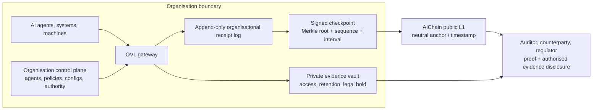

# Future-Proof Organisational Verification Architecture

| Field | Value |
|---|---|
| Status | Research-backed proposal — no new protocol decision is implied |
| Document version | 0.1 |
| Last updated | 2026-08-22 |
| Scope | Enterprise private-verification model, public anchoring, use-case profiles, crypto migration, and decision proposals |
| Architecture inputs | [AI Verification & ZK Architecture](./ai-verification-and-zk-architecture.md); [Autonomous Machines Product Vision](./autonomous-machines-product-vision.md) |

## 1. Executive Proposal

Keep **one neutral, public AIChain L1** as the independent settlement and verification anchor. Add a portable **Organisational Verification Ledger (OVL)** profile that businesses can run within their own security and data boundary. The OVL records detailed private receipts and periodically anchors a signed checkpoint root to AIChain.

This is preferable to making each customer deploy a separate private L1 at this stage. It retains confidentiality and organisational control while preserving a common, independently verifiable public timestamp and audit surface.



The L1 proves that a submitted checkpoint was included under the chain's rules. An inclusion proof can show that a private receipt belonged to that checkpoint. Neither fact alone proves that an AI result was correct, a policy was sufficient, or a business omitted no adverse events. Those higher claims need a defined attestation, policy, witness, or proof model.

This proposal aligns with the IETF's transparent-supply-chain model: a transparency service issues a receipt showing inclusion of a signed statement in a verifiable data structure ([RFC 9943](https://www.rfc-editor.org/rfc/rfc9943.html)).

## 2. Why an Organisational Ledger, Not a Private L1 Yet

### Recommended default: OVL + public anchoring

An OVL is an append-only, customer-controlled evidence and receipt service, **not initially another consensus network**. It may be operated by the customer, by AIChain, or in a compliant managed environment. It produces signed, sequence-linked Merkle checkpoints that anchor to AIChain.

This follows the useful separation in permissioned systems between confidential data held by authorised parties and a shared hash/commitment ([Hyperledger Fabric private data](https://hyperledger-fabric.readthedocs.io/en/latest/private-data/private-data.html)). AIChain should standardise the portable receipt, checkpoint, inclusion-proof, and auditor-package formats—not prematurely mandate Fabric or any other private-ledger product.

| Option | Benefit | Cost / limitation | Recommendation |
|---|---|---|---|
| OVL + AIChain anchor | Private data/control; common neutral audit root; lightweight deployment; interoperable | Customer can still omit events before a checkpoint without additional controls | **Start here** |
| AIChain shared verification domain | Multiple organisations independently replicate a selected case log | Requires membership, governance, availability, and dispute rules | Later, only for multi-party workflows |
| Per-customer private L1 | Maximum isolation and custom rules | High operational burden; fragmented verification; weak network effects | Do not make this the initial product |

### Organisational view / control plane

The customer-facing product should be an **organisation view**, not merely a transaction list. It should let an authorised organisation see and govern:

- organisations, agents, models, machines, and their keys;
- approved configurations, policies, authorities, delegations, and revocations;
- private receipts and the evidence-access / retention state associated with them;
- checkpoint intervals, anchor status, sequence gaps, and proof-verification status; and
- auditor or counterparty disclosure packages with least-privilege access.

This maps naturally to governance, inventories, and lifecycle controls stressed in the [NIST AI Risk Management Framework](https://www.nist.gov/itl/ai-risk-management-framework). It is an application/control-plane feature; it does **not** require putting sensitive organisation data on the public L1.

## 3. The Protocol Building Blocks to Standardise First

### 3.1 Verification Receipt envelope

Define a single versioned envelope for all profiles. It should contain only references/commitments to private artefacts, not raw prompts, outputs, sensor streams, credentials, or policies.

| Field group | Proposed purpose | Decision state |
|---|---|---|
| `receiptVersion`, `profile`, `receiptId` | Versioning and deterministic identity | Proposal; canonical encoding **TBD** |
| `issuer`, `subject`, `authorityRef` | Who asserts, what acted, and under which delegated authority | Proposal; identity/trust rules **TBD** |
| `eventType`, `eventTime`, `sequence`, `parents` | Semantic event, claimed time, ordering, and causal lineage | Proposal; profile rules **TBD** |
| `model/config/policy commitments` | Bind the declared execution context | Proposal; disclosure and salting rules **TBD** |
| `evidence commitments` | Bind private inputs/outputs/logs/artifacts | Proposal; storage/retention **TBD** |
| `attestation` | Signed assertion, runtime evidence, and/or verifier appraisal | Proposal; trust model **TBD** |
| `proof references` | Optional ZK or other precisely defined proof result | Proposal; statement/verifier **TBD** |
| `cryptoSuite` | Approved signing, hash, commitment, and serialization suite identifiers | Proposal; initial suite **TBD** |

Use an explicit cryptographic-suite registry and a small number of reviewed profiles, rather than exposing arbitrary algorithm choices to application developers. The W3C Data Integrity model makes the same case for cryptographic-suite versioning, agility, and layering ([W3C VC Data Integrity 1.0](https://www.w3.org/TR/vc-data-integrity/)).

### 3.2 Organisational checkpoint

Each OVL checkpoint should minimally commit to:

```json
{
  "checkpointVersion": "TBD",
  "organisationRef": "opaque identifier or commitment",
  "ledgerId": "key-bound ledger identifier",
  "epoch": 123,
  "previousCheckpoint": "prior checkpoint hash",
  "receiptRoot": "Merkle root",
  "firstSequence": 1000,
  "lastSequence": 1999,
  "createdAt": "claimed UTC time",
  "cryptoSuite": "approved suite identifier",
  "signature": "organisation / ledger signature"
}
```

The public anchor records the checkpoint commitment plus only the metadata required for public verification. The OVL later supplies a Merkle inclusion proof and an authorised evidence package to an auditor.

For high-risk use cases, checkpointing needs anti-omission controls: required sealing cadence, monotonic sequence numbers, expected-count rules, independent observers or regulator/auditor co-signatures, and alerts for gaps. An anchor proves inclusion of what was submitted; it cannot prove a customer never withheld an event.

### 3.3 Credentials, authority, and runtime attestation

Keep these as three distinct evidence types:

1. **Credential / delegation:** the organisation says an agent, machine, or service key may act within stated bounds.
2. **Execution assertion:** an issuer says an event occurred.
3. **Runtime attestation / appraisal:** an attester presents evidence about a runtime state and a verifier evaluates it under a policy.

The third role should use the vocabulary and separation of the [IETF RATS architecture](https://www.rfc-editor.org/rfc/rfc9334.html): Attester, Verifier, Relying Party, Evidence, appraisal policy, and Attestation Result. This prevents a UI from accidentally presenting a self-signed agent assertion as an independently appraised hardware/runtime fact.

## 4. Assurance Model: Make What Is Known Legible

The product should display **evidence dimensions**, not one misleading “verified” badge. The following levels are a proposal for workshop and naming review:

| Dimension | Proposed states | What it can support |
|---|---|---|
| Anchor | unanchored / batch-anchored / individually anchored | Historical inclusion and integrity of committed data |
| Issuer authority | self-asserted / delegated / organisation-authorised / revoked or expired | Whether a configured authority path existed at the evaluated time |
| Execution evidence | issuer-signed / externally attested / verifier-appraised | Who made the claim and whether appraisal occurred |
| Policy evidence | referenced / deterministic check passed / ZK statement verified | Only the policy claim exactly defined by the referenced rule or proof |
| Disclosure | commitment-only / selectively disclosed / full authorised evidence | What a verifier actually received |

Avoid blanket claims such as “AI verified,” “compliant,” “safe,” or “true.” C2PA makes a closely related distinction for media provenance: its provenance assertions are useful evidence but are not a judgment about the truth of content ([C2PA specifications](https://c2pa.org/specifications/)).

## 5. Use-Case Profiles

Profiles share the envelope and checkpoint mechanism, but each sets its own evidence boundary and assurance language.

| Profile | Core receipt links | Private by default | First useful verification |
|---|---|---|---|
| Enterprise agent action | agent, delegation, model/config/policy, approval, action/output | prompts, outputs, customer data, policies | The action was committed by an authorised agent under a referenced configuration/policy |
| Agent-to-agent workflow | both parties, offers/acceptances, authorities, parent receipts | commercial terms and private limits | Each counterparty can verify the other party’s declared authority and common event history |
| Content provenance | C2PA manifest/claim hash, producer authority, workflow receipt | source files and private workflow data | The public anchor binds the referenced provenance manifest and declared workflow context |
| AI supply chain | component/model/tool/data/approval lineage via `parents` | full logs, data, internal contracts | A disclosed component trail matches committed lineage |
| Robotics / vehicle / drone event | machine identity, firmware/config, operating authority, significant-event evidence | telemetry, video, location, raw sensors | A significant-event evidence package existed in the checkpointed history |

For content, build an interoperable profile that **references C2PA** rather than duplicating its manifest model. For edge devices, commit incident- or safety-relevant state transitions, not continuous raw telemetry.

## 6. Scaling and Evidence Retention

The recommended scale path is:

```text
many private leaf receipts
        -> organisational Merkle batches
        -> signed OVL checkpoint
        -> AIChain batch anchor
        -> optional aggregate proof / independent witness
```

This lets the business retain rich evidence locally while AIChain receives a compact, independently timestamped root. It complements the current batch-anchor prototype and keeps public-chain capacity focused on settlement-grade commitments.

Retention is an enterprise policy concern, not a chain-storage feature. Define evidence classes, encryption/key custody, deletion/expiry behaviour, legal hold, export, and what remains publicly verifiable after a private artifact has been deleted. A durable public root can prove that a now-unavailable artifact was once committed; it cannot restore the artifact.

## 7. Post-Quantum and Crypto-Agility Plan

The existing requirement to evaluate quantum resistance for the final GPU-friendly PoW is necessary but insufficient. Quantum-risk planning also applies to wallet/account signatures, organisation and agent keys, long-lived evidence signatures, encrypted evidence, and ZK-verifier upgrades. NIST's PQC transition work explicitly addresses moving from quantum-vulnerable signatures and key establishment to post-quantum alternatives ([NIST IR 8547](https://csrc.nist.gov/pubs/ir/8547/ipd)).

### Proposed staged posture

1. **Now — suite-aware formats:** add versioned `cryptoSuite`, key identifier, and algorithm-policy fields to off-chain receipt/checkpoint/credential formats. Keep current EVM wallet signing as a compatibility transport mechanism, not as a claim of post-quantum security.
2. **Transition readiness:** support key rotation, overlapping validity, re-signing of long-lived evidence, verifier versioning, and migration attestations. Make verification reports state which suite was used.
3. **Hybrid evaluation:** evaluate a current signature plus a NIST-standardised PQ signature in the off-chain evidence layer, with explicit size, performance, custody, and verifier-cost measurements. Do not mark the hybrid profile as selected until those results exist.
4. **L1 evolution:** separately evaluate account abstraction / native verifier implications and long-term consensus security. A PQ receipt signature does not make EVM transaction signatures or PoW quantum-resistant.

NIST has released its PQC standards path, but migration remains an architectural programme rather than a one-time algorithm substitution ([NIST PQC](https://www.nist.gov/pqc)).

## 8. ZK: Apply It Where It Is Credible First

Do not begin by trying to prove arbitrary frontier-model inference. Start ZK evaluation with deterministic wrapper claims that have clear witnesses and public inputs:

- an approved policy version was applied to a committed action;
- a delegated authority limit was not exceeded;
- a confidential value falls inside an approved range; or
- a receipt belongs to a committed batch without revealing the other leaves.

Every proof must bind a statement ID, statement version, receipt/checkpoint root, policy/configuration commitments, verifier key/version, and public-input encoding. This makes later RISC Zero, SP1, Halo2, or other stack comparisons meaningful rather than premature.

## 9. Decisions to Take Next

These are proposals for explicit decisions, not decisions made by this research.

| Proposed ID | Decision | Recommended answer | Why now |
|---|---|---|---|
| ARCH-002 | Enterprise deployment model | Adopt OVL + AIChain anchoring as the default; defer a private L1 | Directs product and SDK design without locking a vendor |
| AVR-008 | Receipt architecture | One profile-based Verification Receipt envelope with distinct receipt, credential, attestation, and checkpoint objects | Prevents incompatible schemas per use case |
| AVR-009 | Assurance presentation | Use multi-dimensional evidence states; prohibit a single generic “verified” claim | Prevents overclaiming |
| PRIV-002 | OVL privacy baseline | Private evidence stays in the organisation boundary; public L1 gets commitments/checkpoint metadata only | Sets safe default before APIs proliferate |
| SCALE-003 | Anchor hierarchy | Leaf receipt → Merkle batch → signed checkpoint → L1 anchor, with individual anchors only for exceptions | Matches the high-volume requirement |
| CRYPTO-001 | Crypto agility | Require suite IDs, key rotation, re-signing/migration records, and verification reports from the first stable schema | Keeps the PQ path open |
| PROFILE-001 | Initial pilots | Prioritise enterprise-agent governance and content provenance / supply-chain interoperability | Tests high-value, tractable assurance claims |

## 10. Implementation Sequence After Approval

1. Record ADRs for ARCH-002, AVR-008, AVR-009, PRIV-002, SCALE-003, and CRYPTO-001.
2. Extend the AVR draft only with versioned object boundaries and suite identifiers; keep all values provisional.
3. Implement a local OVL reference service: receipt append, Merkle tree, signed checkpoint, anchor submission, inclusion proof, and verifier report.
4. Add organisation-control-plane views for authority/configuration/policy inventories and anchor health.
5. Produce auditor disclosure bundles and one enterprise-agent pilot profile.
6. Add C2PA reference support as the first interoperability profile.
7. Benchmark the end-to-end checkpoint path using the established receipt-volume methodology before selecting capacity targets or a ZK stack.

## 11. Open Questions and Boundaries

- Whether customers can self-host, use AIChain hosting, or require a later consortium domain is a commercial and deployment decision.
- Whether an auditor/witness signature is mandatory in high-risk profiles is a profile and governance decision.
- Identity format, credential issuer governance, revocation, evidence encryption, data residency, and retention remain **TBD**.
- No private-ledger technology, post-quantum signature suite, ZK stack, consensus algorithm, or new L1 protocol rule is selected here.
- This document does not alter the agreed Core-Geth/EVM/PoW architecture.

## 12. Change Log

| Version | Date | Change | Reference |
|---|---|---|---|
| 0.1 | 2026-08-22 | Initial research-backed organisational-verification proposal | ARCH-002 et al. proposed |
